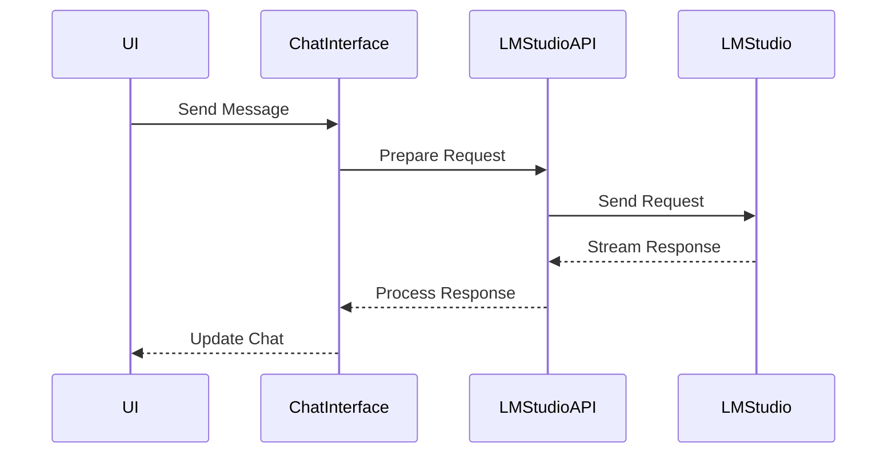
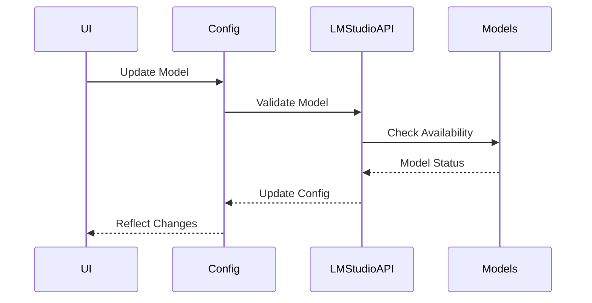
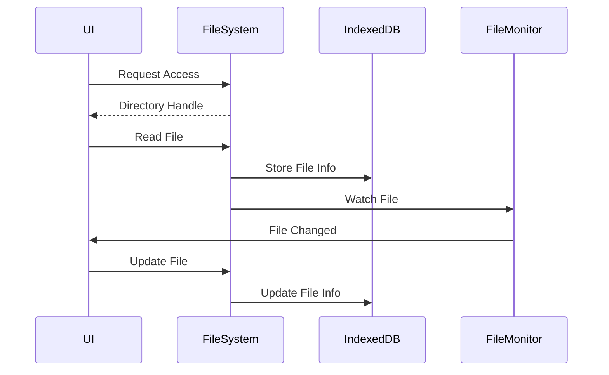
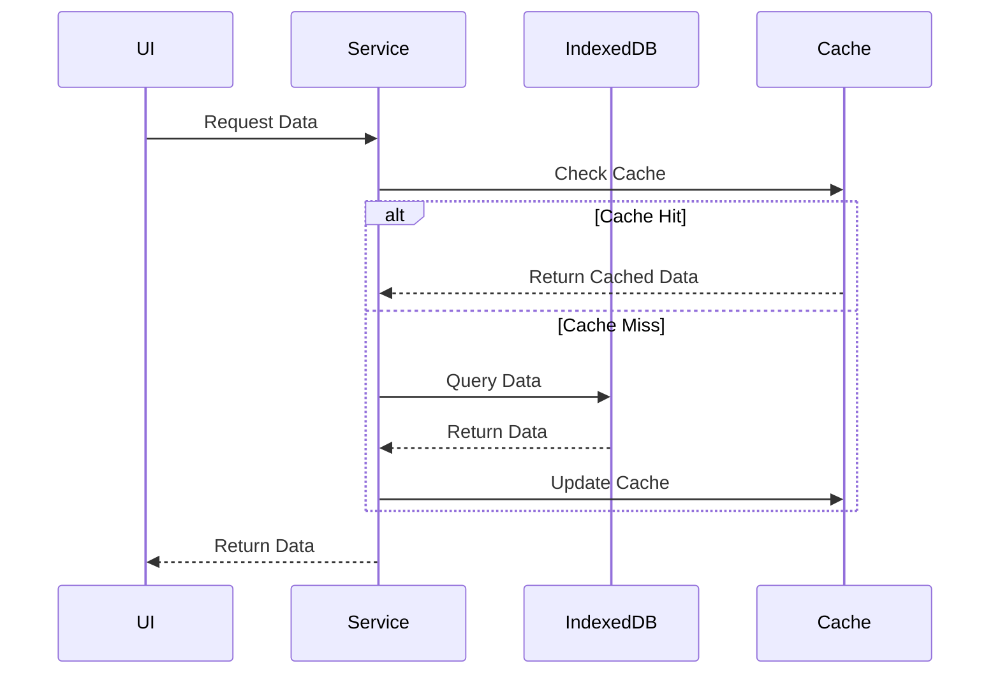
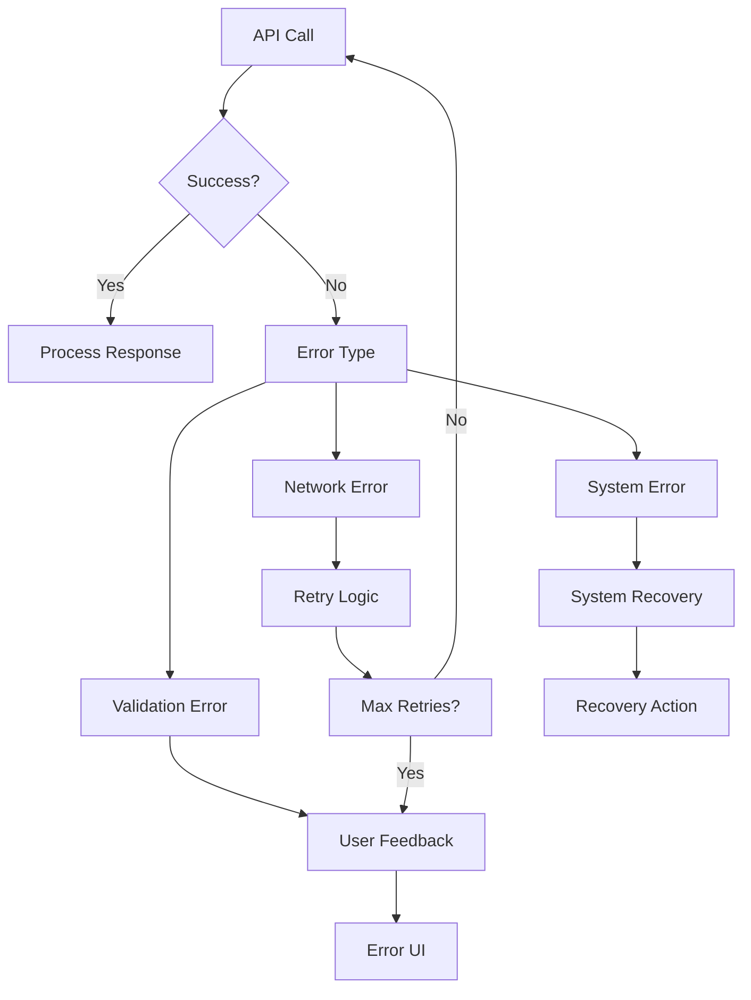
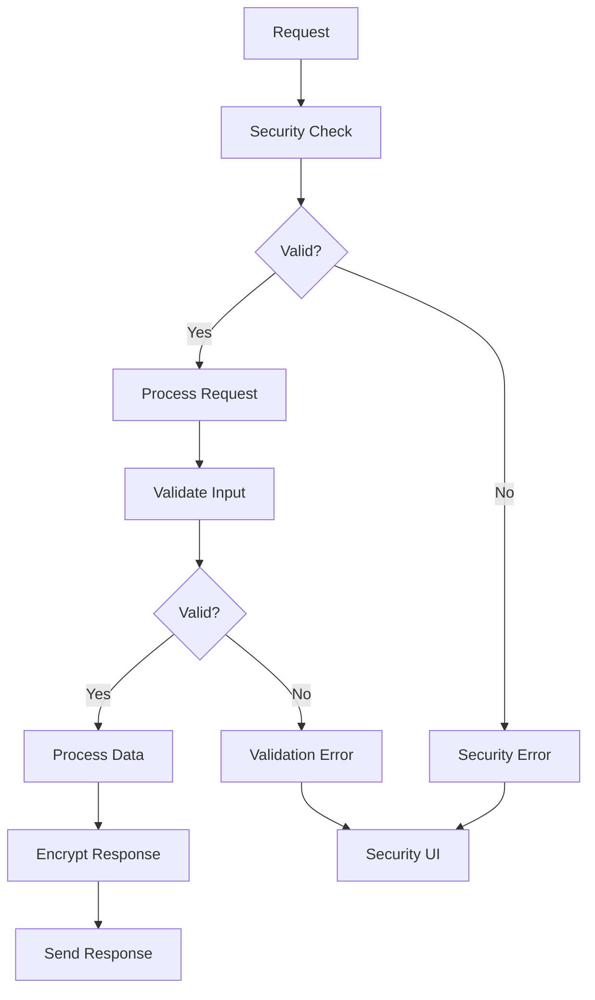

# API Documentation

## LM Studio Integration

### Configuration
```typescript
interface LMStudioConfig {
  baseUrl: string;
  apiKey?: string;
  primaryModelName: string;
  secondaryModelName: string;
  supportsVision?: boolean;
}

interface MCPServer {
  id: string;
  name: string;
  url: string;
  apiKey: string;
  isActive: boolean;
  requiresAuthentication?: boolean;
}
```

### API Endpoints

#### Chat Completion
```typescript
POST /v1/chat/completions
Request:
{
  messages: Array<{
    role: 'system' | 'user' | 'assistant';
    content: string;
  }>;
  model: string;
  temperature?: number;
  max_tokens?: number;
  top_p?: number;
  top_k?: number;
  stream?: boolean;
}

Response:
{
  id: string;
  choices: Array<{
    message: {
      role: string;
      content: string;
    };
    finish_reason: string;
  }>;
  usage: {
    prompt_tokens: number;
    completion_tokens: number;
    total_tokens: number;
  };
}
```

#### Model Information
```typescript
GET /v1/models
Response:
{
  data: Array<{
    id: string;
    object: string;
    owned_by: string;
    permission: Array<{
      id: string;
      object: string;
      created: number;
      allow_create_engine: boolean;
      allow_sampling: boolean;
      allow_logprobs: boolean;
      allow_search_indices: boolean;
      allow_view: boolean;
      allow_fine_tuning: boolean;
      organization: string;
      group: string | null;
      is_blocking: boolean;
    }>;
    root: string;
    parent: string | null;
  }>;
}
```

### Model Presets

#### Open Source Models
```typescript
const openSourceModelPresets = [
  {
    name: "Mixtral 8x7B Instruct v0.1",
    modelName: "Mixtral-8x7B-Instruct-v0.1",
    contextLength: 32768,
    description: "Mistral AI's mixture-of-experts model with 8 experts",
    category: "open",
    tags: ["high-performance", "instruction-tuned", "mixture-of-experts"],
    recommendedSettings: {
      temperature: 0.7,
      topP: 0.9,
      maxTokens: 2048
    }
  },
  {
    name: "Dolphin 2.9 Mistral 7B",
    modelName: "dolphin-2.9-mistral-7b",
    contextLength: 8192,
    description: "Dolphin fine-tuned version of Mistral 7B",
    category: "open",
    tags: ["conversational", "instruction-tuned", "fine-tuned"],
    recommendedSettings: {
      temperature: 0.7,
      topP: 0.9,
      maxTokens: 1024
    }
  }
];
```

#### Proprietary Models
```typescript
const proprietaryModelPresets = [
  {
    name: "GPT-4",
    modelName: "gpt-4",
    contextLength: 128000,
    description: "OpenAI's most advanced model",
    category: "proprietary",
    tags: ["high-performance", "high-quality"],
    recommendedSettings: {
      temperature: 0.7,
      topP: 0.95,
      maxTokens: 2048
    }
  },
  {
    name: "GPT-3.5 Turbo",
    modelName: "gpt-3.5-turbo",
    contextLength: 16384,
    description: "OpenAI's efficient model",
    category: "proprietary",
    tags: ["efficient", "fast", "cost-effective"],
    recommendedSettings: {
      temperature: 0.7,
      topP: 0.9,
      maxTokens: 1024
    }
  }
];
```

### Error Handling

```typescript
enum LMStudioErrorType {
  CONNECTION_ERROR = 'CONNECTION_ERROR',
  AUTHENTICATION_ERROR = 'AUTHENTICATION_ERROR',
  INVALID_REQUEST = 'INVALID_REQUEST',
  MODEL_ERROR = 'MODEL_ERROR',
  RATE_LIMIT = 'RATE_LIMIT',
  UNKNOWN_ERROR = 'UNKNOWN_ERROR'
}

interface LMStudioError {
  type: LMStudioErrorType;
  message: string;
  details?: any;
}
```

### API Flow Diagrams

#### Chat Flow


#### Model Selection Flow


### Security Considerations

1. **API Key Management**
   - Secure storage in localStorage
   - Optional authentication
   - Key validation on connection

2. **Request Validation**
   - Input sanitization
   - Parameter validation
   - Rate limiting support

3. **Error Handling**
   - Graceful degradation
   - User feedback
   - Retry mechanisms

### Performance Optimization

1. **Caching Strategy**
   - Response caching
   - Model info caching
   - Config persistence

2. **Connection Management**
   - Connection pooling
   - Keep-alive support
   - Reconnection logic

3. **Resource Usage**
   - Stream processing
   - Memory management
   - Background processing

## File System API

### File System Access
```typescript
interface FileSystemHandle {
  kind: 'file' | 'directory';
  name: string;
  getFile(): Promise<File>;
  createWritable(): Promise<FileSystemWritableFileStream>;
}

interface FileSystemDirectoryHandle extends FileSystemHandle {
  kind: 'directory';
  getDirectoryHandle(name: string, options?: { create?: boolean }): Promise<FileSystemDirectoryHandle>;
  getFileHandle(name: string, options?: { create?: boolean }): Promise<FileSystemFileHandle>;
  removeEntry(name: string): Promise<void>;
  resolve(possibleDescendant: FileSystemHandle): Promise<string[] | null>;
}
```

### File Operations
```typescript
interface FileOperations {
  readFile(handle: FileSystemFileHandle): Promise<string>;
  writeFile(handle: FileSystemFileHandle, content: string): Promise<void>;
  deleteFile(handle: FileSystemFileHandle): Promise<void>;
  listDirectory(handle: FileSystemDirectoryHandle): Promise<FileSystemHandle[]>;
}
```

## IndexedDB API

### Database Operations
```typescript
interface DatabaseOperations {
  // Notes
  createNote(note: Note): Promise<string>;
  getNote(id: string): Promise<Note | null>;
  updateNote(id: string, note: Partial<Note>): Promise<void>;
  deleteNote(id: string): Promise<void>;
  listNotes(folderId?: string): Promise<Note[]>;
  
  // Folders
  createFolder(folder: Folder): Promise<string>;
  getFolder(id: string): Promise<Folder | null>;
  updateFolder(id: string, folder: Partial<Folder>): Promise<void>;
  deleteFolder(id: string): Promise<void>;
  listFolders(parentId?: string): Promise<Folder[]>;
  
  // Embeddings
  createEmbedding(embedding: Embedding): Promise<string>;
  getEmbedding(id: string): Promise<Embedding | null>;
  getEmbeddingsByNote(noteId: string): Promise<Embedding[]>;
  deleteEmbedding(id: string): Promise<void>;
  
  // Files
  createFile(file: File): Promise<string>;
  getFile(id: string): Promise<File | null>;
  updateFile(id: string, file: Partial<File>): Promise<void>;
  deleteFile(id: string): Promise<void>;
  listFiles(path?: string): Promise<File[]>;
}
```

## API Flow Diagrams

### LM Studio Integration Flow


### File System Operations Flow


### Database Operations Flow


## Error Handling

### API Error Types
```typescript
interface APIError {
  code: string;
  message: string;
  details?: any;
}

enum ErrorCodes {
  // LM Studio Errors
  LM_STUDIO_CONNECTION_ERROR = 'LM_STUDIO_CONNECTION_ERROR',
  LM_STUDIO_TIMEOUT = 'LM_STUDIO_TIMEOUT',
  LM_STUDIO_RATE_LIMIT = 'LM_STUDIO_RATE_LIMIT',
  
  // File System Errors
  FILE_SYSTEM_ACCESS_DENIED = 'FILE_SYSTEM_ACCESS_DENIED',
  FILE_SYSTEM_NOT_SUPPORTED = 'FILE_SYSTEM_NOT_SUPPORTED',
  FILE_NOT_FOUND = 'FILE_NOT_FOUND',
  
  // Database Errors
  DATABASE_CONNECTION_ERROR = 'DATABASE_CONNECTION_ERROR',
  DATABASE_QUOTA_EXCEEDED = 'DATABASE_QUOTA_EXCEEDED',
  RECORD_NOT_FOUND = 'RECORD_NOT_FOUND',
  
  // General Errors
  NETWORK_ERROR = 'NETWORK_ERROR',
  VALIDATION_ERROR = 'VALIDATION_ERROR',
  UNKNOWN_ERROR = 'UNKNOWN_ERROR'
}
```

### Error Handling Flow


## Rate Limiting

### Rate Limit Configuration
```typescript
interface RateLimitConfig {
  maxRequests: number;
  timeWindow: number; // milliseconds
  backoffStrategy: 'linear' | 'exponential';
  maxRetries: number;
}
```

### Rate Limit Implementation
```typescript
class RateLimiter {
  private requests: number[] = [];
  private config: RateLimitConfig;
  
  constructor(config: RateLimitConfig) {
    this.config = config;
  }
  
  async checkLimit(): Promise<boolean> {
    const now = Date.now();
    this.requests = this.requests.filter(
      time => now - time < this.config.timeWindow
    );
    
    if (this.requests.length >= this.config.maxRequests) {
      return false;
    }
    
    this.requests.push(now);
    return true;
  }
}
```

## API Security

### Security Measures
1. **API Key Management**
   - Secure storage of API keys
   - Key rotation mechanism
   - Access control

2. **Request Validation**
   - Input sanitization
   - Schema validation
   - Size limits

3. **Response Security**
   - Data encryption
   - CORS configuration
   - Content security policy

### Security Flow


## Performance Optimization

### Caching Strategy
```typescript
interface CacheConfig {
  ttl: number; // Time to live in milliseconds
  maxSize: number;
  strategy: 'lru' | 'fifo';
}

class APICache {
  private cache: Map<string, {
    data: any;
    timestamp: number;
  }> = new Map();
  private config: CacheConfig;
  
  constructor(config: CacheConfig) {
    this.config = config;
  }
  
  async get(key: string): Promise<any | null> {
    const item = this.cache.get(key);
    if (!item) return null;
    
    if (Date.now() - item.timestamp > this.config.ttl) {
      this.cache.delete(key);
      return null;
    }
    
    return item.data;
  }
  
  set(key: string, data: any): void {
    if (this.cache.size >= this.config.maxSize) {
      this.evict();
    }
    
    this.cache.set(key, {
      data,
      timestamp: Date.now()
    });
  }
  
  private evict(): void {
    if (this.config.strategy === 'lru') {
      // Implement LRU eviction
    } else {
      // Implement FIFO eviction
    }
  }
}
```

### Performance Monitoring
```typescript
interface PerformanceMetrics {
  requestCount: number;
  averageResponseTime: number;
  errorRate: number;
  cacheHitRate: number;
}

class APIMonitor {
  private metrics: PerformanceMetrics = {
    requestCount: 0,
    averageResponseTime: 0,
    errorRate: 0,
    cacheHitRate: 0
  };
  
  trackRequest(duration: number, success: boolean): void {
    this.metrics.requestCount++;
    this.metrics.averageResponseTime = 
      (this.metrics.averageResponseTime * (this.metrics.requestCount - 1) + duration) 
      / this.metrics.requestCount;
    
    if (!success) {
      this.metrics.errorRate = 
        (this.metrics.errorRate * (this.metrics.requestCount - 1) + 1) 
        / this.metrics.requestCount;
    }
  }
  
  trackCacheHit(hit: boolean): void {
    this.metrics.cacheHitRate = 
      (this.metrics.cacheHitRate * (this.metrics.requestCount - 1) + (hit ? 1 : 0)) 
      / this.metrics.requestCount;
  }
}
``` 