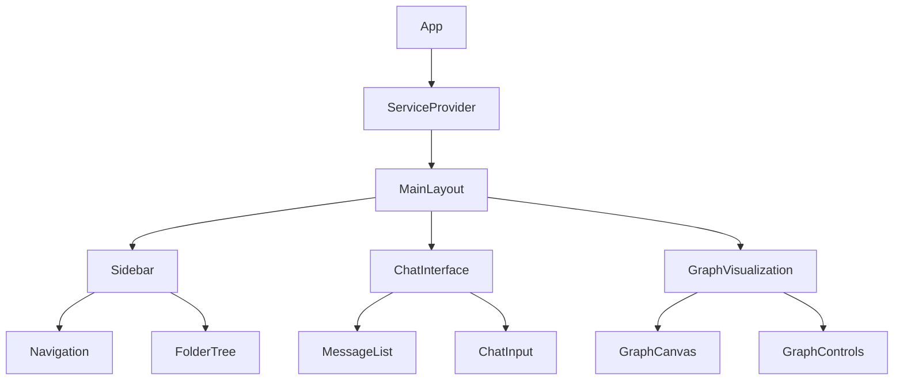
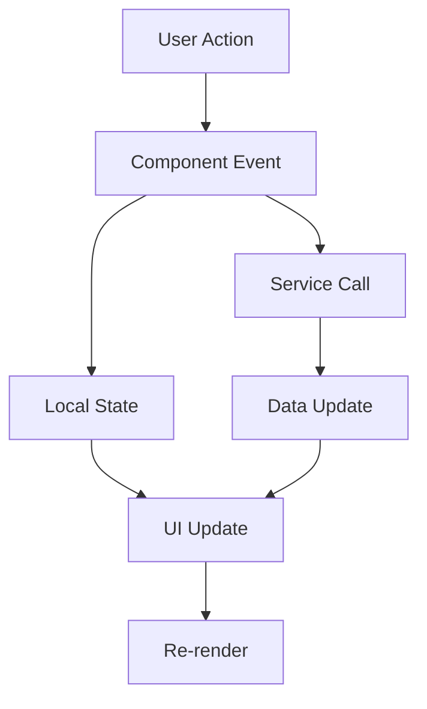
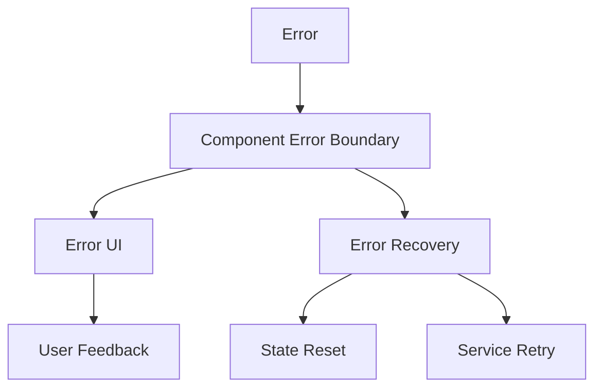

# Components Documentation

## Core Components

### Service Provider
The root component that manages service initialization and dependency injection.

```typescript
interface ServiceProviderProps {
  children: React.ReactNode;
}

const ServiceProvider: React.FC<ServiceProviderProps> = ({ children }) => {
  // Service initialization and context management
  const [isInitialized, setIsInitialized] = useState(false);
  const [error, setError] = useState<Error | null>(null);
  
  // Service registration and dependency injection
  const services = useServiceRegistry();
  
  // Error handling and recovery
  const handleError = useErrorHandler();
  
  return (
    <ServiceContext.Provider value={services}>
      <ErrorBoundary onError={handleError}>
        {isInitialized ? children : <LoadingScreen />}
      </ErrorBoundary>
    </ServiceContext.Provider>
  );
};
```

### MainLayout
The primary layout component that manages the application's structure.

```typescript
interface MainLayoutProps {
  children: React.ReactNode;
}

const MainLayout: React.FC<MainLayoutProps> = ({ children }) => {
  // Layout state management
  const [isSidebarOpen, setSidebarOpen] = useState(true);
  const [activeSection, setActiveSection] = useState('notes');
  
  // Responsive layout handling
  const { width } = useWindowSize();
  const isMobile = width < 768;
  
  return (
    <div className="flex h-screen">
      <Sidebar 
        isOpen={isSidebarOpen} 
        onToggle={setSidebarOpen}
        activeSection={activeSection}
        onSectionChange={setActiveSection}
      />
      <main className="flex-1 overflow-hidden">
        {children}
      </main>
      <ChatPanel />
    </div>
  );
};
```

### Chat Interface
The AI interaction component that manages conversations with LM Studio.

```typescript
interface ChatInterfaceProps {
  modelName?: string;
  temperature?: number;
  maxTokens?: number;
}

const ChatInterface: React.FC<ChatInterfaceProps> = (props) => {
  // Chat state management
  const [messages, setMessages] = useState<ChatMessage[]>([]);
  const [isTyping, setIsTyping] = useState(false);
  
  // LM Studio integration
  const { chat, processImage } = useLMStudio(props);
  
  // Message handling
  const handleSend = async (message: string) => {
    // Message processing logic
  };
  
  return (
    <div className="flex flex-col h-full">
      <ChatHeader />
      <MessageList messages={messages} />
      <ChatInput onSend={handleSend} isTyping={isTyping} />
    </div>
  );
};
```

### Graph Visualization
Interactive knowledge graph visualization component.

```typescript
interface GraphVisualizationProps {
  nodes: Node[];
  edges: Edge[];
  onNodeClick?: (node: Node) => void;
  onEdgeClick?: (edge: Edge) => void;
}

const GraphVisualization: React.FC<GraphVisualizationProps> = (props) => {
  // Graph state management
  const [selectedNode, setSelectedNode] = useState<Node | null>(null);
  const [zoom, setZoom] = useState(1);
  
  // Graph rendering and interaction
  const graphRef = useRef<HTMLDivElement>(null);
  const { layout, update } = useGraphLayout();
  
  return (
    <div className="relative w-full h-full" ref={graphRef}>
      <GraphControls zoom={zoom} onZoomChange={setZoom} />
      <GraphCanvas
        nodes={props.nodes}
        edges={props.edges}
        layout={layout}
        zoom={zoom}
        onNodeClick={props.onNodeClick}
        onEdgeClick={props.onEdgeClick}
      />
      {selectedNode && <NodeDetails node={selectedNode} />}
    </div>
  );
};
```

### Settings Panel
Application configuration and management component.

```typescript
interface SettingsPanelProps {
  onSave?: (settings: Settings) => void;
  onReset?: () => void;
}

const SettingsPanel: React.FC<SettingsPanelProps> = (props) => {
  // Settings state management
  const [settings, setSettings] = useState<Settings>(defaultSettings);
  const [isDirty, setIsDirty] = useState(false);
  
  // Settings sections
  const sections = [
    {
      title: 'AI Models',
      component: <ModelSettings />
    },
    {
      title: 'Servers',
      component: <ServerConfig />
    },
    {
      title: 'Interface',
      component: <InterfaceSettings />
    },
    {
      title: 'Advanced',
      component: <AdvancedSettings />
    }
  ];
  
  return (
    <div className="p-4 space-y-4">
      <SettingsHeader isDirty={isDirty} onSave={() => props.onSave?.(settings)} />
      <Tabs defaultValue="ai-models">
        {sections.map(section => (
          <TabsContent key={section.title} value={section.title.toLowerCase()}>
            {section.component}
          </TabsContent>
        ))}
      </Tabs>
    </div>
  );
};
```

## UI Components

### Common Components
- `Button`: Customizable button component with variants
- `Input`: Text input with validation and states
- `Select`: Dropdown selection component
- `Dialog`: Modal dialog with animations
- `Tabs`: Tabbed interface component
- `Card`: Container component with variants
- `Toast`: Notification component

### Form Components
- `Form`: Form wrapper with validation
- `FormField`: Form field container
- `FormLabel`: Form label component
- `FormMessage`: Form error message
- `FormDescription`: Form field description

### Data Display
- `Table`: Data table component
- `List`: List component with variants
- `Tree`: Tree view component
- `Badge`: Status badge component
- `Progress`: Progress indicator

### Navigation
- `Sidebar`: Application sidebar
- `Breadcrumb`: Navigation breadcrumb
- `Menu`: Dropdown menu component
- `Tabs`: Tab navigation component
- `CommandPalette`: Command interface

## Component Architecture

### Component Hierarchy



### State Flow



### Error Boundaries



## Component Guidelines

### Best Practices
1. **Component Structure**
   - Clear separation of concerns
   - Single responsibility principle
   - Proper prop typing
   - Error boundary implementation

2. **State Management**
   - Local state when possible
   - Service integration through hooks
   - Proper state initialization
   - Cleanup on unmount

3. **Performance**
   - Memoization where needed
   - Lazy loading of heavy components
   - Proper dependency arrays
   - Event handler optimization

4. **Accessibility**
   - ARIA attributes
   - Keyboard navigation
   - Focus management
   - Screen reader support

### Component Testing
1. **Unit Tests**
   - Component rendering
   - Props validation
   - Event handling
   - State changes

2. **Integration Tests**
   - Component interactions
   - Service integration
   - Error handling
   - User flows

3. **Visual Tests**
   - Layout consistency
   - Responsive design
   - Theme support
   - Animation testing 