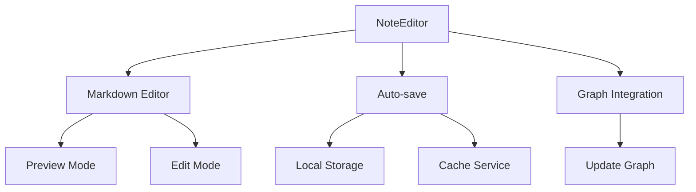
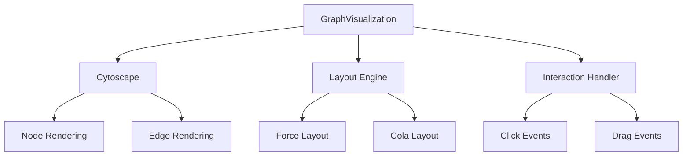
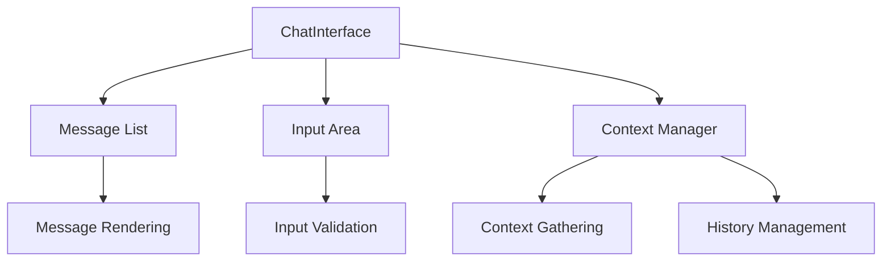
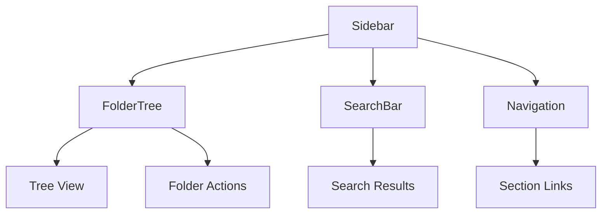
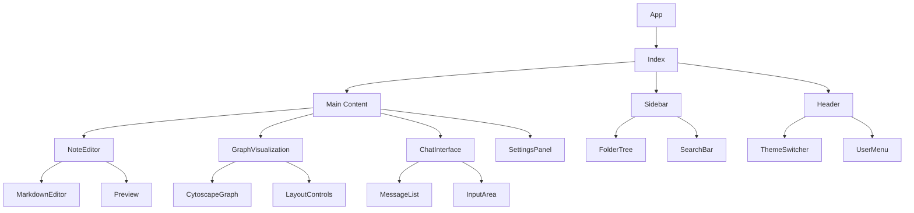
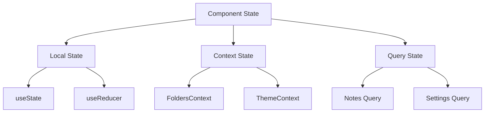
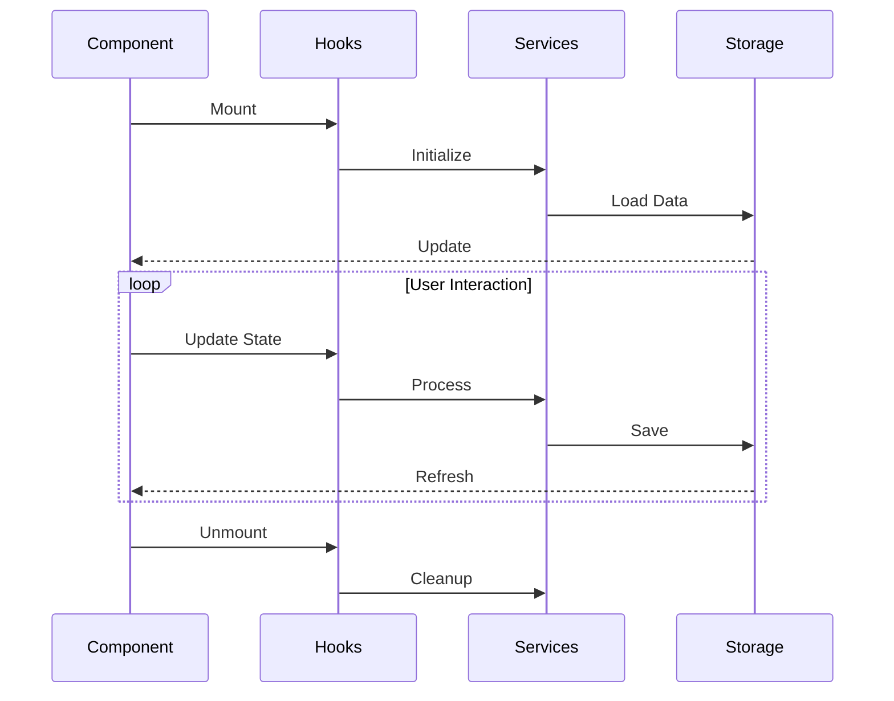
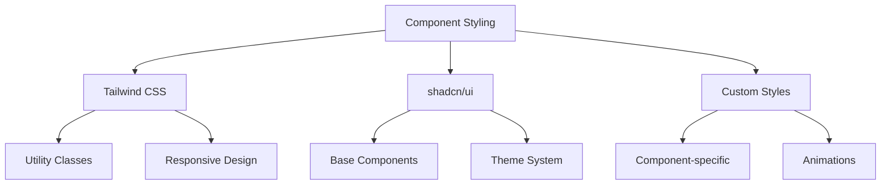

# Component Documentation

## Core Components

### NoteEditor
**Location**: `src/components/NoteEditor.tsx`
**Purpose**: Rich text editor for note creation and editing
**Features**:
- Markdown support
- Real-time updates
- Auto-save functionality
- Integration with graph visualization

### GraphVisualization
**Location**: `src/components/GraphVisualization.tsx`
**Purpose**: Interactive visualization of note relationships
**Features**:
- Force-directed graph layout
- Node and edge interactions
- Zoom and pan controls
- Real-time updates

### ChatInterface
**Location**: `src/components/ChatInterface.tsx`
**Purpose**: AI interaction interface
**Features**:
- Real-time chat
- Message history
- Context awareness
- Code highlighting

### Sidebar
**Location**: `src/components/Sidebar.tsx`
**Purpose**: Navigation and folder management
**Features**:
- Folder tree view
- Quick actions
- Search functionality
- Section navigation

## UI Components

### Button
**Location**: `src/components/ui/button.tsx`
**Purpose**: Reusable button component
**Variants**:
- Primary
- Secondary
- Destructive
- Outline
- Ghost

### Input
**Location**: `src/components/ui/input.tsx`
**Purpose**: Form input component
**Features**:
- Validation support
- Error states
- Disabled states
- Custom styling

### Dialog
**Location**: `src/components/ui/dialog.tsx`
**Purpose**: Modal dialog component
**Features**:
- Accessibility
- Animation
- Backdrop
- Focus management

## Component Relationships

## Component State Management

## Component Lifecycle

## Component Styling

## Best Practices

1. **Component Structure**
   - Keep components focused and single-responsibility
   - Use TypeScript interfaces for props
   - Implement proper error boundaries
   - Follow React hooks best practices

2. **Performance**
   - Use React.memo for expensive renders
   - Implement proper key props
   - Lazy load when appropriate
   - Optimize re-renders

3. **Accessibility**
   - Use semantic HTML
   - Implement ARIA attributes
   - Ensure keyboard navigation
   - Maintain color contrast

4. **Testing**
   - Write unit tests for logic
   - Implement integration tests
   - Test edge cases
   - Maintain test coverage 