# Component Documentation

## Core Components

### NoteEditor
**Location**: `src/components/NoteEditor.tsx`
**Purpose**: Rich text editor for note creation and editing
**Features**:
- Markdown support
- Real-time updates
- Auto-save functionality
- Integration with graph visualization

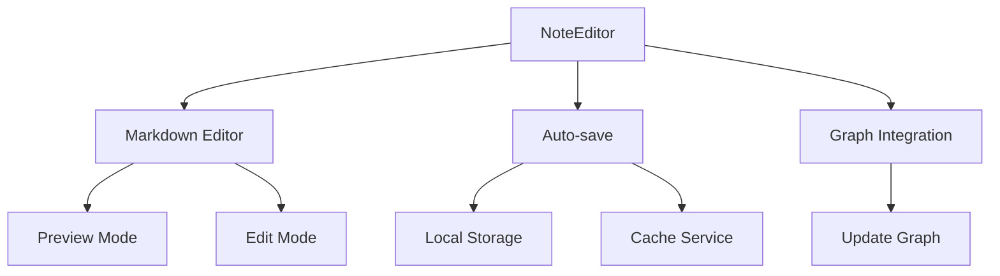

### GraphVisualization
**Location**: `src/components/GraphVisualization.tsx`
**Purpose**: Interactive visualization of note relationships
**Features**:
- Force-directed graph layout
- Node and edge interactions
- Zoom and pan controls
- Real-time updates

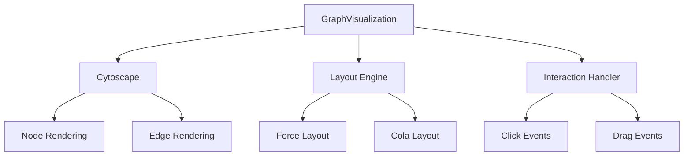

### ChatInterface
**Location**: `src/components/chat/EnhancedChatInterface.tsx`
**Purpose**: AI interaction interface with LM Studio integration
**Features**:
- Real-time chat with streaming
- Multi-model support
- Message history management
- Code highlighting
- Vision capabilities (optional)

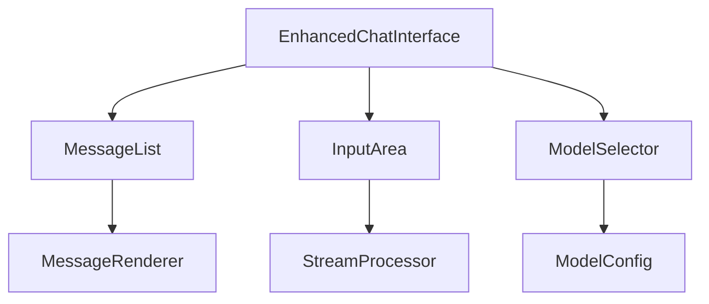

### Sidebar
**Location**: `src/components/Sidebar.tsx`
**Purpose**: Navigation and folder management
**Features**:
- Folder tree view
- Quick actions
- Search functionality
- Section navigation

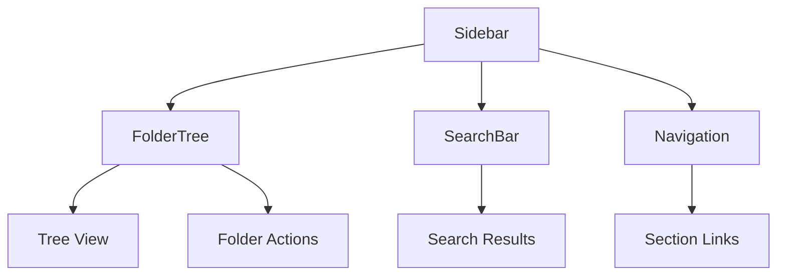

### ServerConfig
**Location**: `src/components/settings/ServerConfig.tsx`
**Purpose**: LM Studio and MCP server configuration
**Features**:
- Server management
- Model configuration
- Connection testing
- API key management

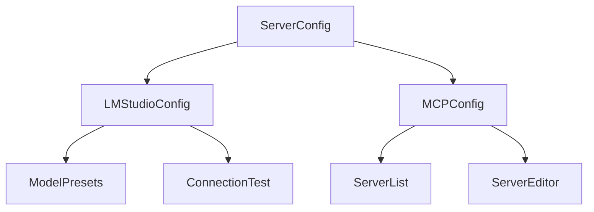

### MainLayout
**Location**: `src/components/layout/MainLayout.tsx`
**Purpose**: Primary application layout
**Features**:
- Responsive layout
- Sidebar integration
- Chat interface
- Section navigation

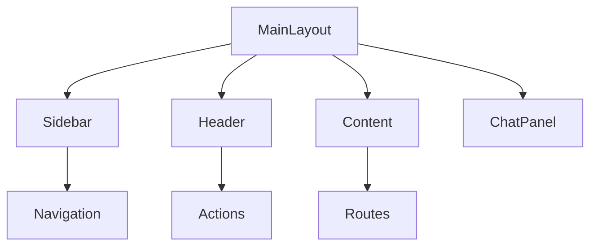

### ModelSettings
**Location**: `src/components/settings/ModelSettings.tsx`
**Purpose**: Model configuration and management
**Features**:
- Model selection
- Parameter configuration
- Preset management
- Connection status

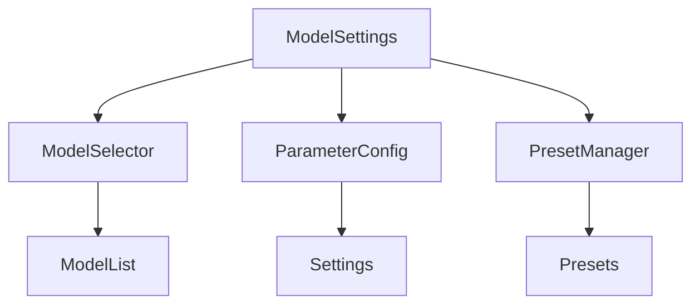

## UI Components

### Button
**Location**: `src/components/ui/button.tsx`
**Purpose**: Reusable button component
**Variants**:
- Primary
- Secondary
- Destructive
- Outline
- Ghost

### Input
**Location**: `src/components/ui/input.tsx`
**Purpose**: Form input component
**Features**:
- Validation support
- Error states
- Disabled states
- Custom styling

### Dialog
**Location**: `src/components/ui/dialog.tsx`
**Purpose**: Modal dialog component
**Features**:
- Accessibility
- Animation
- Backdrop
- Focus management

## Component Relationships

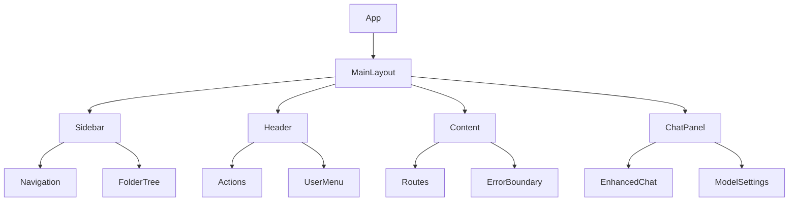

## Component State Management

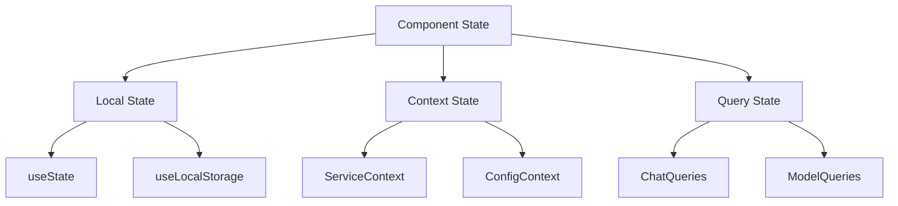

## Component Lifecycle

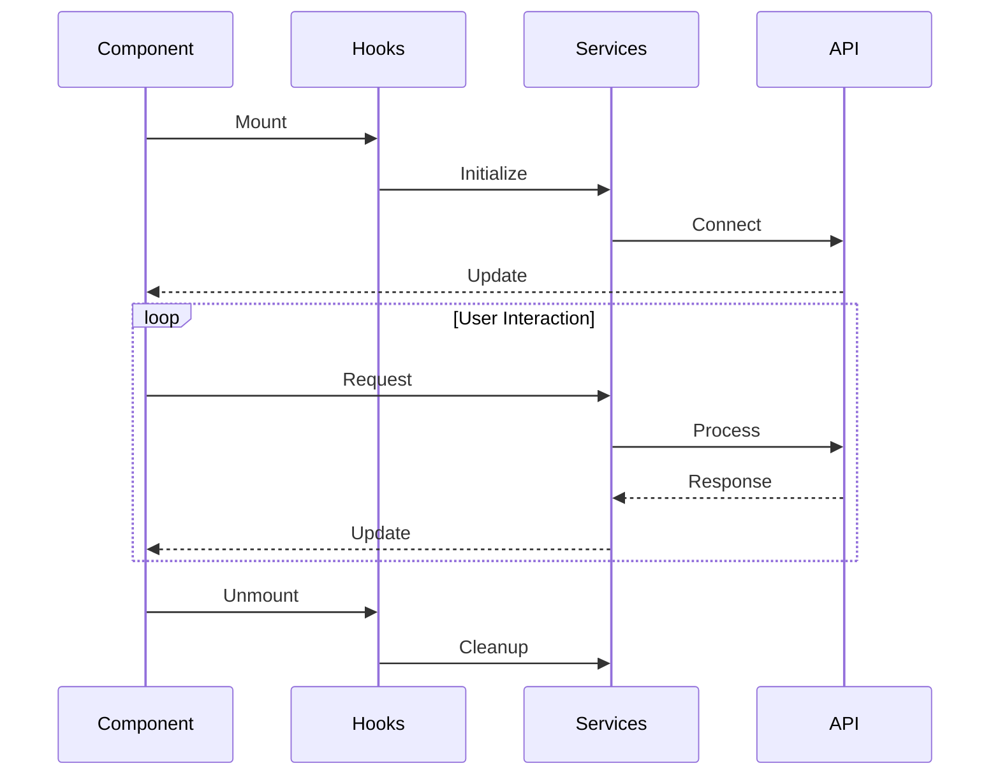

## Component Styling

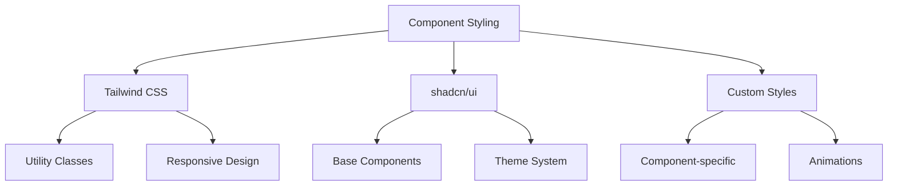

## Best Practices

1. **Component Structure**
   - Use functional components
   - Implement TypeScript types
   - Follow shadcn/ui patterns
   - Maintain error boundaries

2. **State Management**
   - Use appropriate hooks
   - Implement proper caching
   - Handle loading states
   - Manage side effects

3. **Performance**
   - Implement memoization
   - Optimize re-renders
   - Handle async operations
   - Manage resources

4. **Error Handling**
   - Use error boundaries
   - Provide feedback
   - Handle edge cases
   - Log errors properly

5. **Accessibility**
   - Follow ARIA patterns
   - Support keyboard
   - Manage focus
   - Test with tools

6. **Testing**
   - Write unit tests for logic
   - Implement integration tests
   - Test edge cases
   - Maintain test coverage 