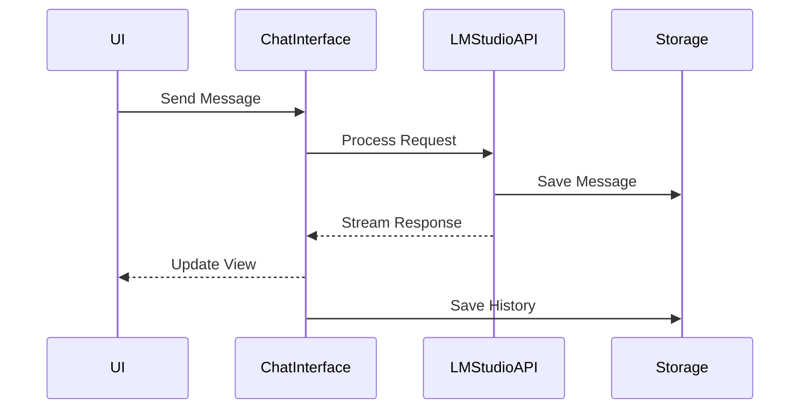
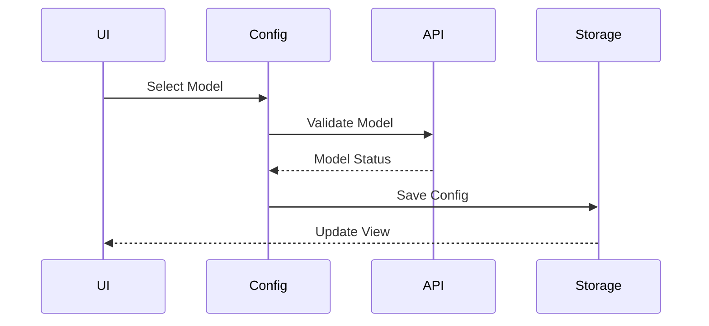
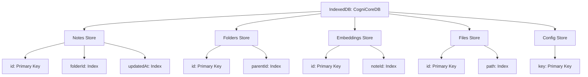
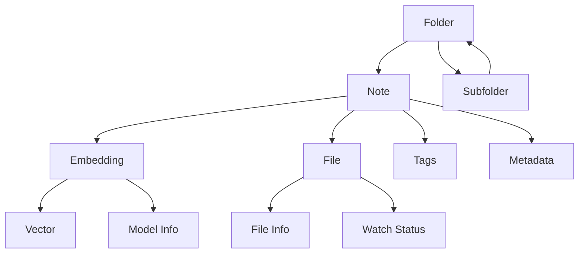
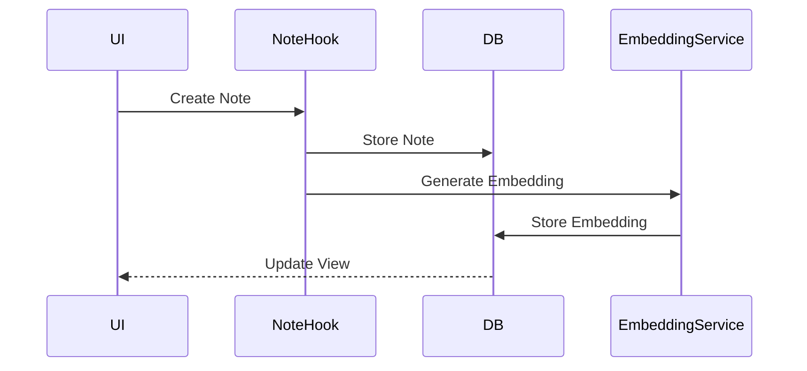
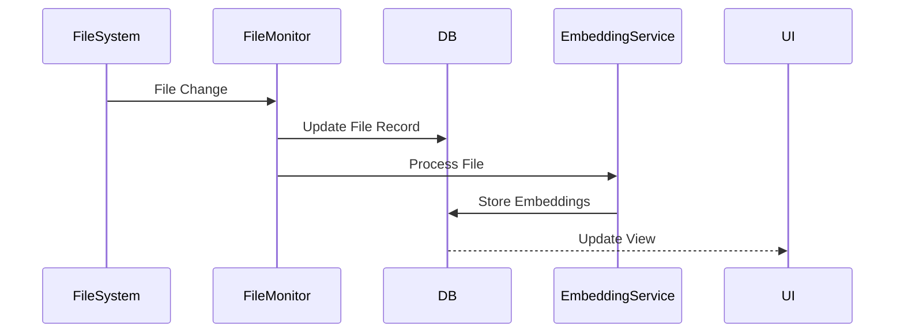
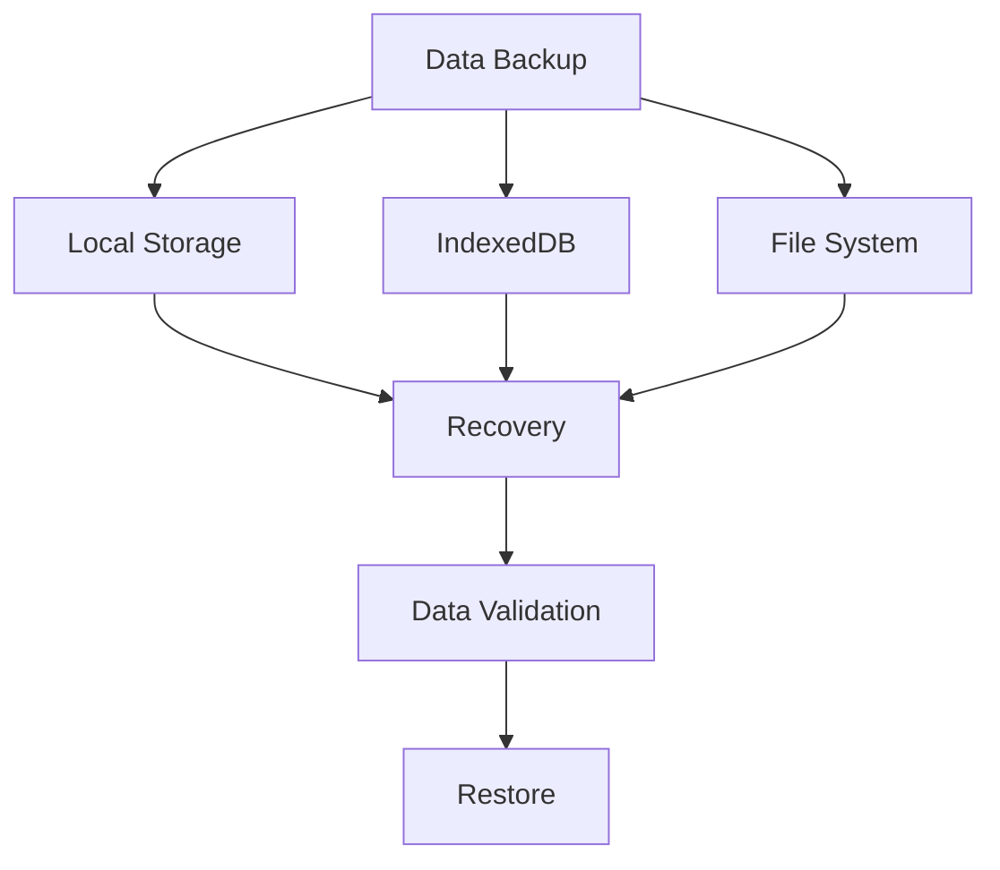
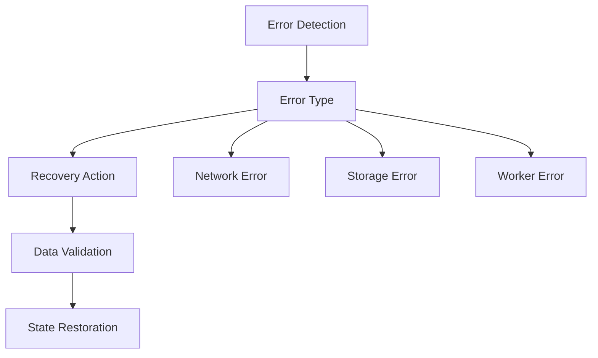

# Data Models Documentation

## Core Models

### LM Studio Configuration
```typescript
interface LMStudioConfig {
  baseUrl: string;
  apiKey?: string;
  primaryModelName: string;
  secondaryModelName: string;
  supportsVision?: boolean;
  temperature: number;
  topP: number;
  topK: number;
  maxTokens: number;
  useVision: boolean;
}
```

### MCP Server
```typescript
interface MCPServer {
  id: string;
  name: string;
  url: string;
  apiKey: string;
  isActive: boolean;
  requiresAuthentication?: boolean;
}
```

### Model Preset
```typescript
interface ModelPreset {
  name: string;
  modelName: string;
  contextLength: number;
  description: string;
  category: 'open' | 'proprietary';
  tags: string[];
  recommendedSettings?: {
    temperature?: number;
    topP?: number;
    topK?: number;
    maxTokens?: number;
  };
}
```

### Chat Message
```typescript
interface ChatMessage {
  id: string;
  role: 'system' | 'user' | 'assistant';
  content: string;
  timestamp: Date;
  metadata?: {
    model?: string;
    tokens?: number;
    processingTime?: number;
  };
}
```

### Chat History
```typescript
interface ChatHistory {
  id: string;
  title: string;
  messages: ChatMessage[];
  createdAt: Date;
  updatedAt: Date;
  model: string;
  settings: {
    temperature: number;
    maxTokens: number;
    topP: number;
    topK: number;
  };
}
```

## Data Flow

### Chat Flow


### Model Selection Flow


## Data Storage

### LocalStorage Schema
```typescript
interface LocalStorageSchema {
  'lmStudio-config': LMStudioConfig;
  'mcp-servers': MCPServer[];
  'chat-histories': ChatHistory[];
  'model-presets': ModelPreset[];
  'app-settings': {
    theme: string;
    fontSize: number;
    autoSave: boolean;
    offline: boolean;
  };
}
```

### Cache Structure
```typescript
interface CacheStructure {
  models: {
    [modelName: string]: {
      info: any;
      lastChecked: Date;
    };
  };
  responses: {
    [messageId: string]: {
      response: string;
      timestamp: Date;
    };
  };
  configs: {
    [serverId: string]: {
      status: 'active' | 'inactive';
      lastChecked: Date;
    };
  };
}
```

## Data Validation

### Config Validation
```typescript
const configSchema = z.object({
  baseUrl: z.string().url(),
  apiKey: z.string().optional(),
  primaryModelName: z.string(),
  secondaryModelName: z.string(),
  temperature: z.number().min(0).max(1),
  topP: z.number().min(0).max(1),
  topK: z.number().min(1),
  maxTokens: z.number().min(1),
  useVision: z.boolean()
});
```

### Message Validation
```typescript
const messageSchema = z.object({
  id: z.string().uuid(),
  role: z.enum(['system', 'user', 'assistant']),
  content: z.string(),
  timestamp: z.date(),
  metadata: z.object({
    model: z.string().optional(),
    tokens: z.number().optional(),
    processingTime: z.number().optional()
  }).optional()
});
```

## Error Handling

### API Errors
```typescript
enum LMStudioErrorType {
  CONNECTION_ERROR = 'CONNECTION_ERROR',
  AUTHENTICATION_ERROR = 'AUTHENTICATION_ERROR',
  INVALID_REQUEST = 'INVALID_REQUEST',
  MODEL_ERROR = 'MODEL_ERROR',
  RATE_LIMIT = 'RATE_LIMIT',
  UNKNOWN_ERROR = 'UNKNOWN_ERROR'
}

interface LMStudioError {
  type: LMStudioErrorType;
  message: string;
  details?: any;
}
```

### Data Migration

```typescript
interface MigrationPlan {
  version: number;
  steps: {
    source: 'localStorage' | 'indexedDB';
    target: 'indexedDB';
    transform: (data: any) => any;
  }[];
}
```

## Performance Considerations

1. **Caching Strategy**
   - Model information caching
   - Response caching
   - Config persistence

2. **Storage Optimization**
   - Message compression
   - History pruning
   - Cache invalidation

3. **Data Loading**
   - Lazy loading
   - Pagination
   - Background updates

## Core Data Models

### Note
```typescript
interface Note {
  id: string;                 // UUID
  title: string;             // Note title
  content: string;           // Markdown content
  folderId: string | null;   // Parent folder ID
  createdAt: Date;          // Creation timestamp
  updatedAt: Date;          // Last update timestamp
  tags: string[];           // Note tags
  metadata: {
    lastAccessed: Date;     // Last access timestamp
    wordCount: number;      // Content word count
    isArchived: boolean;    // Archive status
  };
}
```

### Folder
```typescript
interface Folder {
  id: string;               // UUID
  name: string;             // Folder name
  parentId: string | null;  // Parent folder ID
  createdAt: Date;         // Creation timestamp
  updatedAt: Date;         // Last update timestamp
  metadata: {
    color?: string;        // Optional folder color
    icon?: string;         // Optional folder icon
    isCollapsed: boolean;  // UI state
  };
}
```

### Embedding
```typescript
interface Embedding {
  id: string;              // UUID
  noteId: string;          // Associated note ID
  vector: number[];        // Embedding vector
  model: string;           // Model used for embedding
  createdAt: Date;        // Creation timestamp
  metadata: {
    dimension: number;     // Vector dimension
    similarity?: number;   // Optional similarity score
  };
}
```

### File
```typescript
interface File {
  id: string;              // UUID
  name: string;            // File name
  path: string;            // File path
  type: string;            // File type
  size: number;            // File size in bytes
  lastModified: Date;      // Last modification timestamp
  metadata: {
    hash: string;          // File hash for change detection
    isWatched: boolean;    // File system watch status
  };
}
```

## Database Schema

### IndexedDB Structure


## Data Relationships



## Data Flow

### Note Creation Flow


### File System Integration


## Data Validation

### Note Validation
```typescript
const noteSchema = z.object({
  id: z.string().uuid(),
  title: z.string().min(1).max(100),
  content: z.string(),
  folderId: z.string().uuid().nullable(),
  createdAt: z.date(),
  updatedAt: z.date(),
  tags: z.array(z.string()),
  metadata: z.object({
    lastAccessed: z.date(),
    wordCount: z.number(),
    isArchived: z.boolean()
  })
});
```

### Folder Validation
```typescript
const folderSchema = z.object({
  id: z.string().uuid(),
  name: z.string().min(1).max(100),
  parentId: z.string().uuid().nullable(),
  createdAt: z.date(),
  updatedAt: z.date(),
  metadata: z.object({
    color: z.string().optional(),
    icon: z.string().optional(),
    isCollapsed: z.boolean()
  })
});
```

## Data Migration

### localStorage to IndexedDB Migration
```typescript
interface MigrationPlan {
  version: number;
  steps: {
    source: 'localStorage' | 'indexedDB';
    target: 'indexedDB';
    transform: (data: any) => any;
  }[];
}
```

## Implementation Status

### Current Implementation
1. **Storage Layer**
   - Currently using localStorage through `useLocalStorage` hook
   - Need to implement IndexedDB for better performance and storage limits
   - Migration path needed from localStorage to IndexedDB

2. **File System Integration**
   - File System Access API implementation exists
   - Need fallback mechanisms for unsupported browsers
   - File monitoring system needs proper error handling

3. **Embedding System**
   - Worker-based embedding service implemented
   - Need proper IndexedDB integration
   - Cache management needs improvement

### Planned Improvements

1. **Database Service**
```typescript
class DatabaseService {
  private db: IDBDatabase | null = null;
  
  async initialize(): Promise<boolean> {
    // Implementation needed
  }
  
  async migrateFromLocalStorage(): Promise<void> {
    // Implementation needed
  }
  
  // CRUD operations for all stores
}
```

2. **File System Service**
```typescript
class FileSystemService {
  async requestAccess(): Promise<FileSystemDirectoryHandle | File[] | null> {
    // Implementation with fallbacks needed
  }
  
  async watchDirectory(handle: FileSystemDirectoryHandle): Promise<void> {
    // Implementation with error handling needed
  }
}
```

3. **Embedding Service**
```typescript
class EmbeddingService {
  async generateEmbedding(text: string): Promise<number[]> {
    // Implementation needed
  }
  
  async storeEmbedding(noteId: string, embedding: number[]): Promise<void> {
    // Implementation needed
  }
}
```

## Data Integrity

### Backup and Recovery


### Error Handling


## Performance Considerations

1. **Indexing Strategy**
   - Implement proper indexes for common queries
   - Use compound indexes where appropriate
   - Monitor index performance

2. **Caching Strategy**
   - Implement LRU cache for frequently accessed data
   - Cache embeddings for quick similarity searches
   - Implement proper cache invalidation

3. **Data Structure Optimization**
   - Use appropriate data types
   - Implement efficient tree structures
   - Optimize for common operations

4. **Storage Limits**
   - Implement proper quota management
   - Handle storage full scenarios
   - Provide user feedback for storage issues 