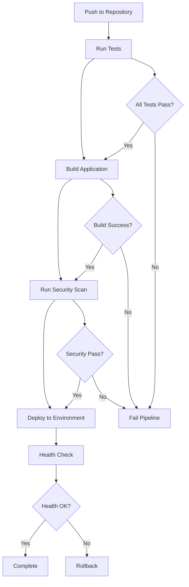
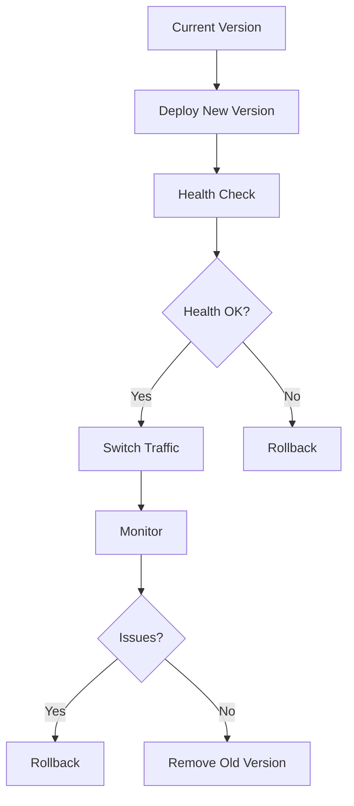
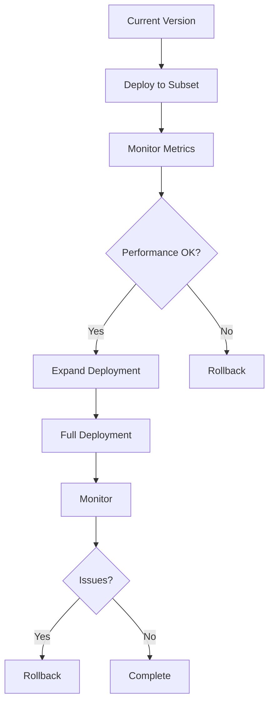
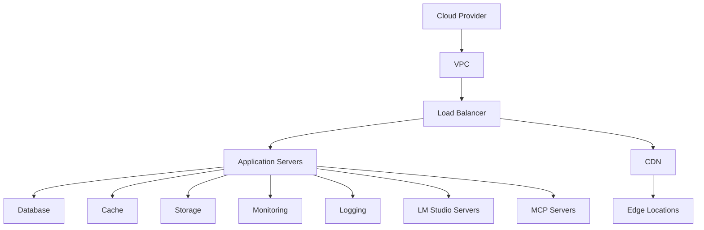

# Deployment Documentation

## Build Process

### Build Configuration
```typescript
// vite.config.ts
import { defineConfig } from 'vite';
import react from '@vitejs/plugin-react-swc';
import path from 'path';

export default defineConfig({
  plugins: [react()],
  resolve: {
    alias: {
      '@': path.resolve(__dirname, './src'),
    },
  },
  build: {
    outDir: 'dist',
    sourcemap: true,
    rollupOptions: {
      output: {
        manualChunks: {
          vendor: ['react', 'react-dom'],
          ui: ['@radix-ui/react-*'],
          utils: ['date-fns', 'zod'],
          api: ['@/api/lmStudioApi', '@/api/mcpApi'],
        },
      },
    },
  },
});
```

### Build Scripts
```json
{
  "scripts": {
    "build": "vite build",
    "build:dev": "vite build --mode development",
    "build:prod": "vite build --mode production",
    "preview": "vite preview",
    "build:docker": "docker build -t cognicore .",
    "deploy:docker": "docker-compose up -d"
  }
}
```

## Deployment Environments

### Environment Configuration
```typescript
// src/config/environment.ts
interface EnvironmentConfig {
  apiUrl: string;
  lmStudioUrl: string;
  mcpServers: {
    url: string;
    apiKey: string;
  }[];
  maxCacheSize: number;
  enableAnalytics: boolean;
  modelPresets: ModelPreset[];
}

const environments = {
  development: {
    apiUrl: 'http://localhost:3000',
    lmStudioUrl: 'http://localhost:1234',
    mcpServers: [
      {
        url: 'http://localhost:8080',
        apiKey: process.env.MCP_API_KEY
      }
    ],
    maxCacheSize: 100,
    enableAnalytics: false,
    modelPresets: developmentModelPresets
  },
  staging: {
    apiUrl: 'https://staging-api.cognicore.app',
    lmStudioUrl: 'https://staging-lmstudio.cognicore.app',
    mcpServers: [
      {
        url: 'https://staging-mcp.cognicore.app',
        apiKey: process.env.STAGING_MCP_API_KEY
      }
    ],
    maxCacheSize: 500,
    enableAnalytics: true,
    modelPresets: stagingModelPresets
  },
  production: {
    apiUrl: 'https://api.cognicore.app',
    lmStudioUrl: 'https://lmstudio.cognicore.app',
    mcpServers: [
      {
        url: 'https://mcp.cognicore.app',
        apiKey: process.env.PROD_MCP_API_KEY
      }
    ],
    maxCacheSize: 1000,
    enableAnalytics: true,
    modelPresets: productionModelPresets
  },
};
```

## Deployment Pipeline

### CI/CD Pipeline


## Deployment Strategies

### Blue-Green Deployment


### Canary Deployment


## Infrastructure

### Cloud Infrastructure


### Resource Configuration
```typescript
// infrastructure.ts
interface ResourceConfig {
  vpc: {
    cidr: string;
    subnets: SubnetConfig[];
  };
  ecs: {
    cluster: {
      name: string;
      capacity: number;
    };
    service: {
      name: string;
      replicas: number;
      cpu: number;
      memory: number;
    };
  };
  rds: {
    instance: string;
    storage: number;
    backup: boolean;
  };
  elasticache: {
    nodeType: string;
    numNodes: number;
  };
  s3: {
    buckets: {
      assets: string;
      backups: string;
      models: string;
    };
  };
  lmStudio: {
    instances: {
      type: string;
      count: number;
      storage: number;
    };
    models: {
      storage: number;
      backup: boolean;
    };
  };
  mcp: {
    instances: {
      type: string;
      count: number;
      storage: number;
    };
    loadBalancer: {
      type: string;
      ssl: boolean;
    };
  };
}
```

## Monitoring and Logging

### Monitoring Setup
```typescript
// monitoring.ts
interface MonitoringConfig {
  metrics: {
    cpu: boolean;
    memory: boolean;
    disk: boolean;
    network: boolean;
    api: boolean;
    models: boolean;
  };
  alerts: {
    cpuThreshold: number;
    memoryThreshold: number;
    errorRateThreshold: number;
    apiLatencyThreshold: number;
    modelLoadThreshold: number;
  };
  dashboards: {
    performance: string[];
    errors: string[];
    business: string[];
    api: string[];
    models: string[];
  };
}
```

### Logging Configuration
```typescript
// logging.ts
interface LoggingConfig {
  levels: {
    error: boolean;
    warn: boolean;
    info: boolean;
    debug: boolean;
  };
  destinations: {
    cloudwatch: boolean;
    elasticsearch: boolean;
    s3: boolean;
  };
  retention: {
    cloudwatch: number;
    elasticsearch: number;
    s3: number;
  };
  api: {
    requestLogging: boolean;
    responseLogging: boolean;
    errorLogging: boolean;
  };
  models: {
    loadLogging: boolean;
    performanceLogging: boolean;
    errorLogging: boolean;
  };
}
```

## Docker Configuration

### Dockerfile
```dockerfile
# Build stage
FROM node:18-alpine as builder

WORKDIR /app
COPY package*.json ./
RUN npm install
COPY . .
RUN npm run build

# Production stage
FROM nginx:alpine

COPY --from=builder /app/dist /usr/share/nginx/html
COPY nginx.conf /etc/nginx/conf.d/default.conf

EXPOSE 80
CMD ["nginx", "-g", "daemon off;"]
```

### Docker Compose
```yaml
version: '3.8'

services:
  app:
    build: .
    ports:
      - "80:80"
    environment:
      - NODE_ENV=production
      - LM_STUDIO_URL=http://lmstudio:1234
      - MCP_SERVERS=http://mcp:8080
    depends_on:
      - lmstudio
      - mcp

  lmstudio:
    image: lmstudio/lmstudio:latest
    ports:
      - "1234:1234"
    volumes:
      - lmstudio_data:/data
    environment:
      - API_KEY=${LM_STUDIO_API_KEY}
      - MAX_TOKENS=2048
      - TEMPERATURE=0.7

  mcp:
    image: cognicore/mcp:latest
    ports:
      - "8080:8080"
    volumes:
      - mcp_data:/data
    environment:
      - API_KEY=${MCP_API_KEY}
      - MAX_CONNECTIONS=100
      - TIMEOUT=30

volumes:
  lmstudio_data:
  mcp_data:
```

## Security Considerations

### API Security
```typescript
interface SecurityConfig {
  api: {
    rateLimit: {
      window: number;
      max: number;
    };
    cors: {
      allowedOrigins: string[];
      methods: string[];
      headers: string[];
    };
    auth: {
      type: 'jwt' | 'api-key';
      tokenExpiry: number;
    };
  };
  models: {
    access: {
      type: 'public' | 'private';
      allowedUsers: string[];
    };
    encryption: {
      enabled: boolean;
      algorithm: string;
    };
  };
  storage: {
    encryption: {
      enabled: boolean;
      algorithm: string;
    };
    backup: {
      frequency: string;
      retention: number;
    };
  };
}
```

### Network Security
```typescript
interface NetworkConfig {
  vpc: {
    cidr: string;
    subnets: SubnetConfig[];
  };
  securityGroups: {
    app: {
      inbound: PortConfig[];
      outbound: PortConfig[];
    };
    lmstudio: {
      inbound: PortConfig[];
      outbound: PortConfig[];
    };
    mcp: {
      inbound: PortConfig[];
      outbound: PortConfig[];
    };
  };
  acl: {
    rules: ACLRule[];
  };
}
```

## Backup and Recovery

### Backup Strategy
```typescript
interface BackupConfig {
  database: {
    frequency: string;
    retention: number;
    type: 'full' | 'incremental';
  };
  models: {
    frequency: string;
    retention: number;
    storage: string;
  };
  config: {
    frequency: string;
    retention: number;
    storage: string;
  };
}
```

### Recovery Procedures
```typescript
interface RecoveryConfig {
  database: {
    restorePoint: string;
    validation: boolean;
  };
  models: {
    restorePoint: string;
    validation: boolean;
  };
  config: {
    restorePoint: string;
    validation: boolean;
  };
  monitoring: {
    healthChecks: string[];
    alerts: string[];
  };
}
```

## Deployment Checklist

### Pre-deployment
1. **Code Review**
   - All tests passing
   - Code quality checks
   - Security review
   - Performance review

2. **Environment Check**
   - Resource availability
   - Configuration validation
   - Backup verification
   - Monitoring setup

3. **Documentation**
   - Release notes
   - API changes
   - Configuration changes
   - Rollback procedures

### Deployment
1. **Execution**
   - Backup current state
   - Deploy new version
   - Health checks
   - Traffic switch

2. **Verification**
   - Functionality tests
   - Performance tests
   - Security tests
   - Integration tests

3. **Monitoring**
   - Error rates
   - Response times
   - Resource usage
   - User impact

### Post-deployment
1. **Cleanup**
   - Remove old versions
   - Clean up resources
   - Update documentation
   - Archive logs

2. **Review**
   - Deployment success
   - Performance impact
   - User feedback
   - Lessons learned

3. **Documentation**
   - Update procedures
   - Document issues
   - Update metrics
   - Share knowledge 