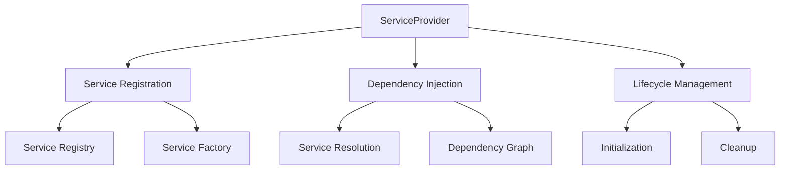
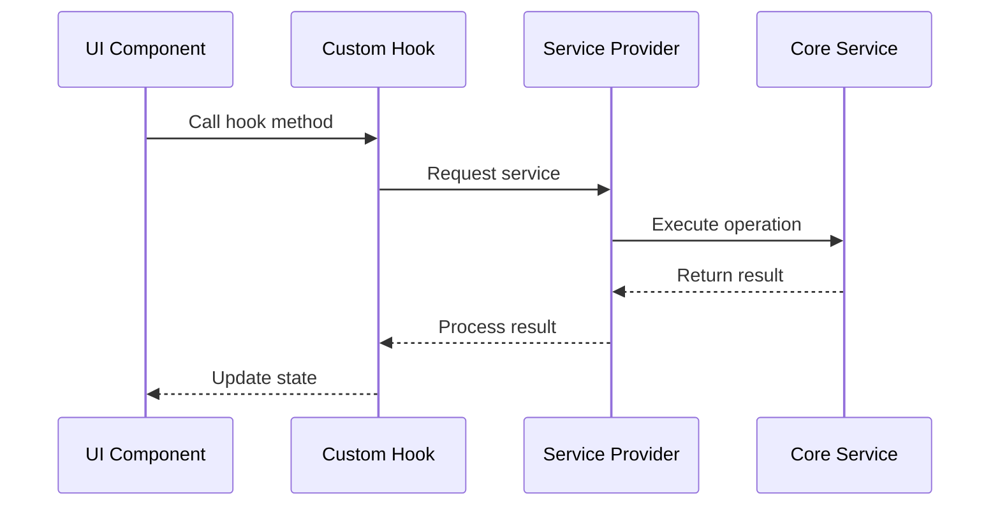
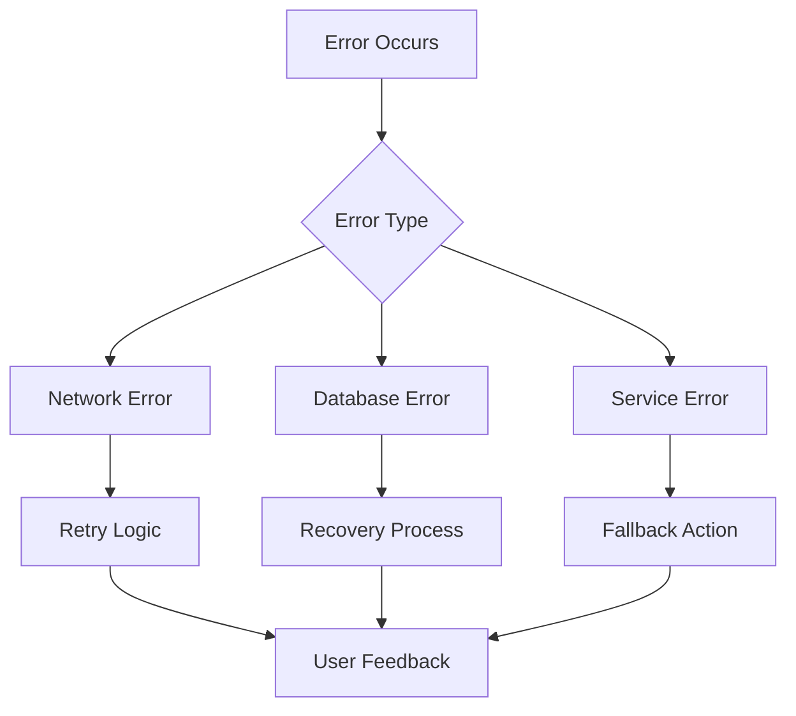
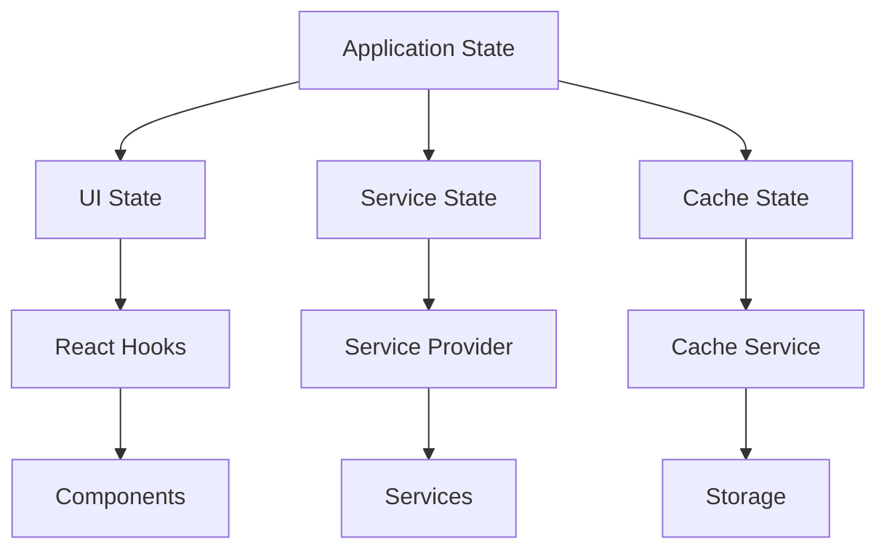

# Hooks and Services Documentation

## Core Services

### Service Provider System

The Service Provider system is the backbone of the application, managing service initialization, dependency injection, and lifecycle management.



### LM Studio Service

The LM Studio service manages interactions with local AI models through LM Studio.

```typescript
interface LMStudioConfig {
  baseUrl: string;
  apiKey: string;
  primaryModelName: string;
  secondaryModelName: string;
  temperature: number;
  maxTokens: number;
  useVision: boolean;
}

class LMStudioService {
  // Core methods
  initialize(): Promise<boolean>;
  chat(messages: ChatMessage[]): Promise<ChatResponse>;
  processImage(image: File, prompt: string): Promise<ChatResponse>;
  
  // Configuration
  updateConfig(config: Partial<LMStudioConfig>): void;
  testConnection(): Promise<boolean>;
  
  // Model management
  listModels(): Promise<Model[]>;
  setModel(modelName: string): Promise<void>;
}
```

### Database Service

Manages data persistence using IndexedDB with localStorage fallback.

```typescript
interface DatabaseConfig {
  name: string;
  version: number;
  stores: StoreConfig[];
}

class DatabaseService {
  // Core operations
  initialize(): Promise<void>;
  get<T>(store: string, key: string): Promise<T>;
  set<T>(store: string, key: string, value: T): Promise<void>;
  delete(store: string, key: string): Promise<void>;
  
  // Transactions
  transaction<T>(stores: string[], mode: 'readonly' | 'readwrite'): Promise<T>;
  
  // Migration
  migrate(): Promise<void>;
  backup(): Promise<Blob>;
  restore(backup: Blob): Promise<void>;
}
```

### File Monitor Service

Monitors file system changes and manages synchronization.

```typescript
interface FileMonitorConfig {
  watchPaths: string[];
  ignorePatterns: string[];
  pollInterval: number;
}

class FileMonitorService {
  // Core functionality
  initialize(config: FileMonitorConfig): Promise<void>;
  startWatching(): Promise<void>;
  stopWatching(): void;
  
  // Event handling
  onFileChange(callback: FileChangeCallback): void;
  onError(callback: ErrorCallback): void;
  
  // Utilities
  getWatchedFiles(): Promise<FileInfo[]>;
  rescanAll(): Promise<void>;
}
```

### Embedding Service

Manages text embeddings for semantic search and similarity matching.

```typescript
interface EmbeddingConfig {
  modelName: string;
  dimension: number;
  batchSize: number;
}

class EmbeddingService {
  // Core operations
  initialize(config: EmbeddingConfig): Promise<void>;
  generateEmbedding(text: string): Promise<number[]>;
  findSimilar(query: string, threshold: number): Promise<SimilarityResult[]>;
  
  // Batch operations
  batchProcess(texts: string[]): Promise<number[][]>;
  
  // Cache management
  cacheEmbedding(key: string, embedding: number[]): Promise<void>;
  clearCache(): Promise<void>;
}
```

## Custom Hooks

### useLMStudio

Hook for interacting with LM Studio models.

```typescript
interface UseLMStudioOptions {
  modelName?: string;
  temperature?: number;
  maxTokens?: number;
}

function useLMStudio(options?: UseLMStudioOptions) {
  // Core functionality
  const { chat, processImage, isLoading, error } = useLMStudio();
  
  // Model management
  const { setModel, currentModel, availableModels } = useModelManagement();
  
  // Configuration
  const { updateConfig, config } = useConfiguration();
  
  return {
    chat,
    processImage,
    setModel,
    currentModel,
    availableModels,
    updateConfig,
    config,
    isLoading,
    error
  };
}
```

### useDatabase

Hook for database operations with automatic error handling and loading states.

```typescript
interface UseDatabaseOptions {
  store: string;
  key?: string;
}

function useDatabase<T>(options: UseDatabaseOptions) {
  // Core operations
  const { data, setData, deleteData, isLoading, error } = useDatabase<T>(options);
  
  // Transactions
  const { transaction, isTransacting } = useTransaction();
  
  // Queries
  const { query, queryResult } = useQuery();
  
  return {
    data,
    setData,
    deleteData,
    transaction,
    query,
    isLoading,
    isTransacting,
    error,
    queryResult
  };
}
```

### useFileMonitor

Hook for monitoring file system changes.

```typescript
interface UseFileMonitorOptions {
  paths?: string[];
  ignore?: string[];
}

function useFileMonitor(options?: UseFileMonitorOptions) {
  // Monitoring
  const { files, changes, errors } = useFileMonitor(options);
  
  // Control
  const { start, stop, rescan } = useMonitorControl();
  
  // Events
  const { onFileChange, onError } = useMonitorEvents();
  
  return {
    files,
    changes,
    errors,
    start,
    stop,
    rescan,
    onFileChange,
    onError
  };
}
```

### useEmbeddings

Hook for generating and managing embeddings.

```typescript
interface UseEmbeddingsOptions {
  modelName?: string;
  dimension?: number;
}

function useEmbeddings(options?: UseEmbeddingsOptions) {
  // Core functionality
  const { generate, findSimilar, isLoading, error } = useEmbeddings(options);
  
  // Batch operations
  const { batchGenerate, isBatchProcessing } = useBatchOperations();
  
  // Cache management
  const { cache, clearCache } = useCacheManagement();
  
  return {
    generate,
    findSimilar,
    batchGenerate,
    cache,
    clearCache,
    isLoading,
    isBatchProcessing,
    error
  };
}
```

## Service Integration

### Service Communication



### Error Handling



### State Management



## Performance Considerations

1. **Service Initialization**
   - Lazy loading of services
   - Parallel initialization where possible
   - Resource cleanup on unmount
   - Error recovery strategies

2. **Hook Optimization**
   - Proper dependency arrays
   - Memoization of callbacks
   - Debounced updates
   - Batched state updates

3. **Service Communication**
   - Efficient data transfer
   - Request batching
   - Response caching
   - Connection pooling

4. **Error Management**
   - Graceful degradation
   - Automatic retry logic
   - Error boundary integration
   - User feedback mechanisms
