# Hooks and Services Documentation

## Custom Hooks

### useNotes
**Location**: `src/hooks/useNotes.tsx`
**Purpose**: Manage note state and operations
**Features**:
- Note CRUD operations
- Note relationships
- Note search
- Note synchronization

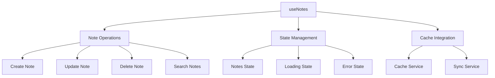

### useFolders
**Location**: `src/hooks/useFolders.tsx`
**Purpose**: Manage folder structure and hierarchy
**Features**:
- Folder CRUD operations
- Tree structure management
- Folder navigation
- Folder permissions

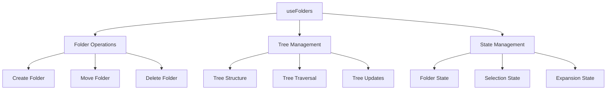

### useEmbeddings
**Location**: `src/hooks/useEmbeddings.tsx`
**Purpose**: Handle AI embeddings and semantic search
**Features**:
- Text embedding generation
- Semantic search
- Similarity calculations
- Cache management

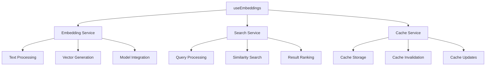

### useOfflineStatus
**Location**: `src/hooks/useOfflineStatus.tsx`
**Purpose**: Manage offline functionality
**Features**:
- Connection status monitoring
- Offline queue management
- Sync status tracking
- Error handling

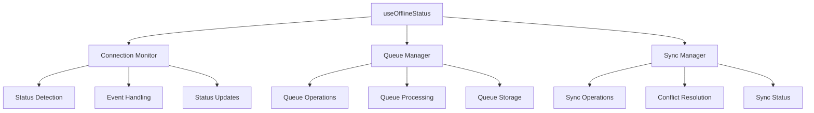

### useLMStudio
**Location**: `src/hooks/useLMStudio.tsx`
**Purpose**: Manage LM Studio integration and configuration
**Features**:
- LM Studio configuration management
- Model selection and validation
- Connection status monitoring
- Error handling and recovery

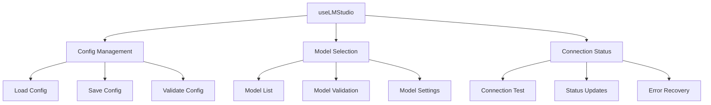

### useMCPServers
**Location**: `src/hooks/useMCPServers.tsx`
**Purpose**: Manage MCP server configurations
**Features**:
- Server CRUD operations
- Server validation
- Connection testing
- Active server management

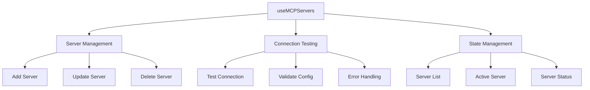

### useChatHistory
**Location**: `src/hooks/useChatHistory.tsx`
**Purpose**: Manage chat history and interactions
**Features**:
- Chat history management
- Message persistence
- Context management
- Model integration

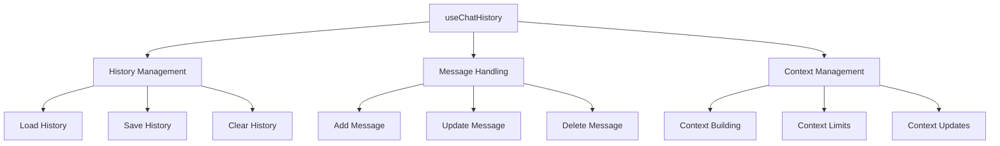

## Services

### cacheService
**Location**: `src/services/cacheService.ts`
**Purpose**: Manage application caching
**Features**:
- Cache initialization
- Cache operations
- Cache invalidation
- Cache persistence

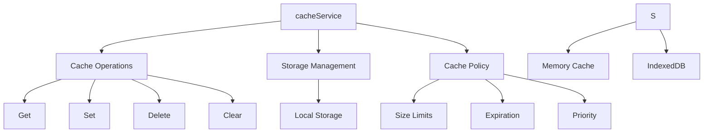

### fileMonitor
**Location**: `src/services/fileMonitor.ts`
**Purpose**: Monitor file system changes
**Features**:
- File watching
- Change detection
- Event handling
- Sync management

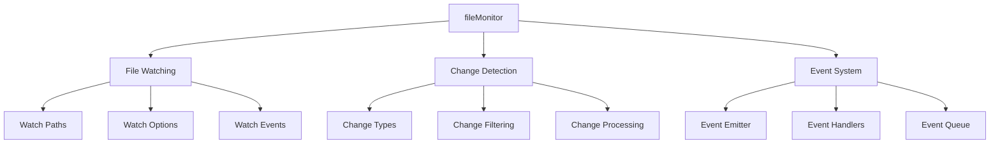

### embeddingWorkerService
**Location**: `src/services/embeddingWorkerService.ts`
**Purpose**: Handle AI embedding operations
**Features**:
- Worker management
- Task processing
- Result handling
- Error management

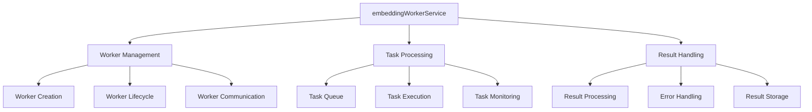

### lmStudioService
**Location**: `src/services/lmStudioService.ts`
**Purpose**: Handle LM Studio API interactions
**Features**:
- API request handling
- Response processing
- Error management
- Rate limiting

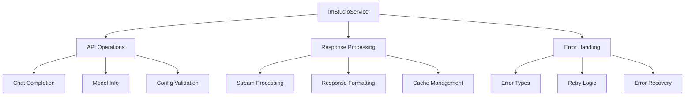

### mcpService
**Location**: `src/services/mcpService.ts`
**Purpose**: Handle MCP server interactions
**Features**:
- Server communication
- Authentication
- Request routing
- Response handling

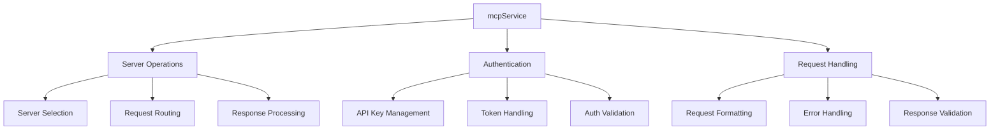

## Service Interactions

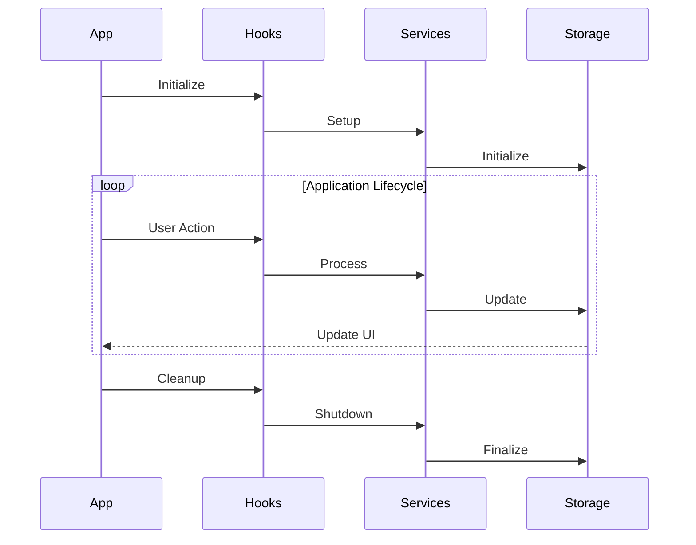

## Data Flow

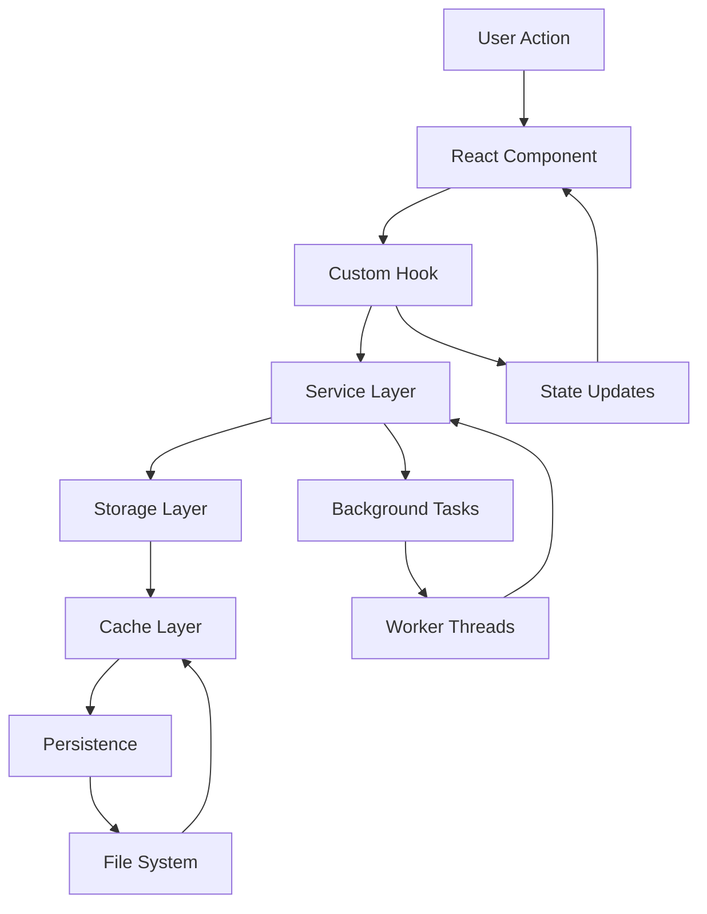

## Error Handling

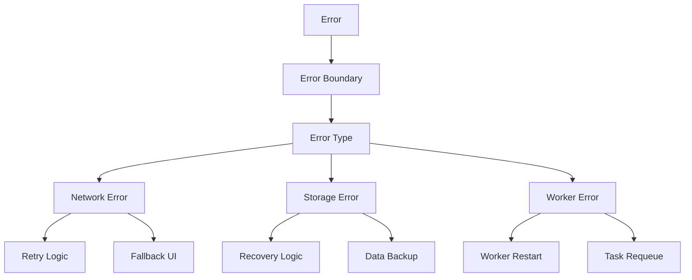

## Performance Considerations

1. **Caching Strategy**
   - Implement proper cache invalidation
   - Use appropriate cache size limits
   - Monitor cache hit rates
   - Optimize cache storage

2. **Worker Management**
   - Control worker pool size
   - Implement task prioritization
   - Handle worker failures
   - Monitor worker performance

3. **State Management**
   - Minimize unnecessary updates
   - Implement proper memoization
   - Use appropriate data structures
   - Optimize state updates

4. **Resource Management**
   - Clean up resources properly
   - Implement proper error handling
   - Monitor memory usage
   - Handle edge cases 