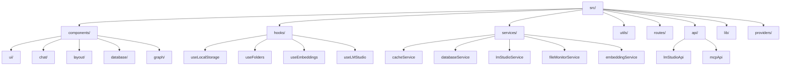
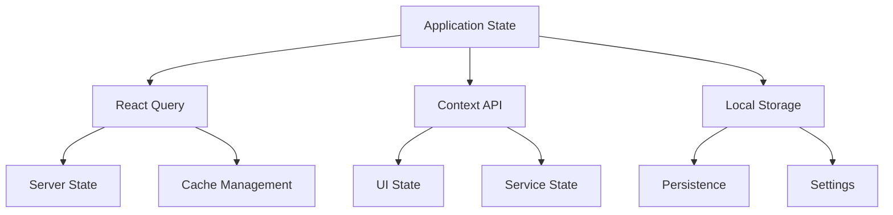
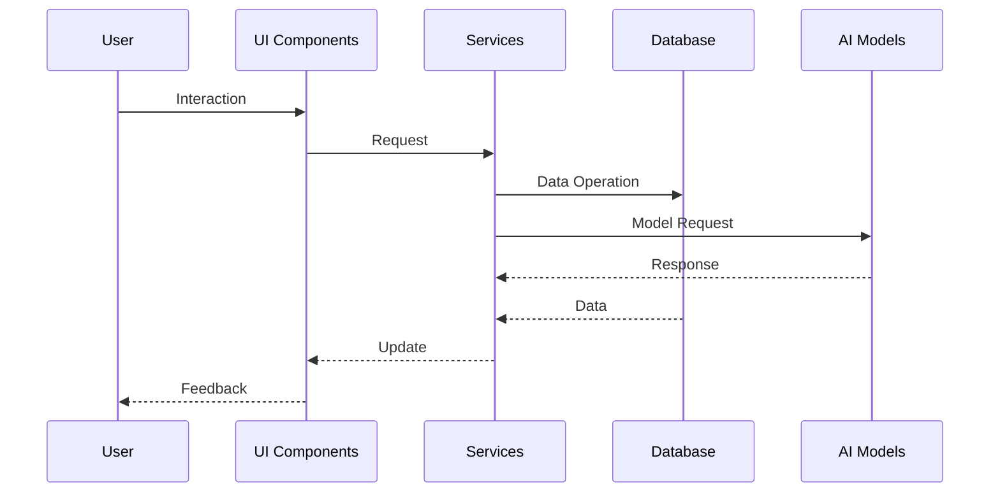
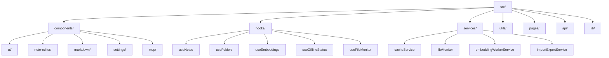
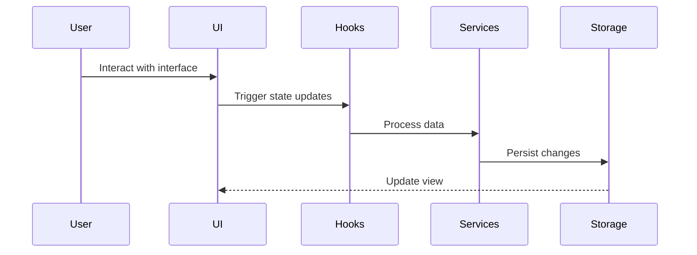

# CogniCore Project Overview

## Introduction

CogniCore is a modern knowledge management and AI interaction platform that combines local AI capabilities with advanced note-taking and visualization features. The application is designed to work with LM Studio for local AI model integration and provides a comprehensive set of tools for knowledge organization and retrieval.

### Core Features

1. **AI Integration**
   - LM Studio integration for local AI models
   - Multi-model support (primary and secondary models)
   - Vision capabilities support
   - Semantic search with local embeddings
   - Context-aware chat interface

2. **Knowledge Management**
   - Rich text editing with Markdown support
   - Hierarchical folder organization
   - Tag-based organization
   - Real-time auto-save
   - Graph-based visualization

3. **System Architecture**
   - Service-oriented architecture
   - Worker-based processing
   - Offline-first capabilities
   - Real-time file monitoring
   - Robust caching system

### Technical Stack

- **Frontend Framework**: React with TypeScript
- **UI Components**: shadcn/ui
- **State Management**: React Query & Context API
- **Storage**: IndexedDB with localStorage fallback
- **AI Integration**: LM Studio API & Local Embedding Service
- **Build System**: Vite

### Project Structure



### Key Components

1. **Service Provider System**
   - Centralized service initialization
   - Dependency injection
   - Service lifecycle management
   - Error handling and recovery

2. **Database Layer**
   - IndexedDB for primary storage
   - Migration support from localStorage
   - Structured data models
   - Transaction management

3. **AI Integration Layer**
   - LM Studio service for model interaction
   - Embedding service for semantic search
   - MCP service for remote model access
   - Vision capabilities integration

4. **File System Integration**
   - Real-time file monitoring
   - Automatic synchronization
   - Change detection
   - Import/Export capabilities

### State Management

The application implements a hybrid state management approach:



### Data Flow



### Security Considerations

1. **API Security**
   - Secure API key management
   - Request validation
   - Rate limiting
   - Error handling

2. **Data Security**
   - Local storage encryption
   - Secure file handling
   - Access control
   - Data validation

3. **Model Security**
   - Local model isolation
   - Input sanitization
   - Output validation
   - Resource limits

### Performance Optimization

1. **Caching Strategy**
   - Multi-level cache
   - Cache invalidation
   - Preloading
   - Resource management

2. **Worker Management**
   - Task prioritization
   - Resource allocation
   - Error recovery
   - Performance monitoring

3. **UI Optimization**
   - Code splitting
   - Lazy loading
   - Virtual scrolling
   - Debounced updates

### Development Guidelines
1. **Component Structure**
   - Use functional components
   - Implement TypeScript types
   - Follow shadcn/ui patterns
   - Maintain proper error boundaries

2. **State Management**
   - Use React Query for async data
   - Implement custom hooks
   - Maintain clean data flow
   - Handle offline capabilities

3. **Code Organization**
   - Group by feature
   - Maintain clear interfaces
   - Document complex logic
   - Follow consistent patterns

### Getting Started
1. Clone the repository
2. Install dependencies: `npm install`
3. Configure LM Studio connection
4. Start development server: `npm run dev`

### Configuration
1. **LM Studio Setup**
   - Configure base URL (default: http://localhost:1234)
   - Set API key (if required)
   - Configure primary and secondary models
   - Enable vision capabilities (optional)

2. **Development Mode**
   - Set environment variables
   - Configure development tools
   - Enable debug features

### Contributing
1. Follow TypeScript guidelines
2. Maintain test coverage
3. Document changes
4. Follow commit conventions

## Tech Stack
- **Frontend Framework**: React 18 with TypeScript
- **Build Tool**: Vite
- **Styling**: Tailwind CSS with shadcn/ui components
- **State Management**: React Query (TanStack Query)
- **Routing**: React Router
- **UI Components**: Radix UI primitives with custom styling
- **Data Visualization**: Cytoscape.js for graph visualization
- **Markdown Support**: React Markdown with GFM
- **Form Handling**: React Hook Form with Zod validation
- **Date Handling**: date-fns
- **Charts**: Recharts

## Core Features
1. **Note Management**
   - Rich text editing with Markdown support
   - Hierarchical folder structure
   - Real-time updates
   - Graph visualization of note relationships

2. **AI Integration**
   - Embedding service for semantic search
   - Chat interface for AI interactions
   - LM Studio integration

3. **Offline Capabilities**
   - Offline-first architecture
   - Queue system for pending operations
   - Cache management
   - File monitoring system

4. **Data Management**
   - Import/Export functionality
   - Local storage management
   - File system monitoring
   - Caching system

5. **User Interface**
   - Responsive design
   - Dark/Light theme support
   - Resizable panels
   - Customizable layout

## Project Structure


## Key Components
1. **App.tsx**: Main application entry point
   - Sets up providers (Query, Router, Folders)
   - Initializes core services
   - Handles diagnostic mode

2. **Index.tsx**: Main page layout
   - Manages sidebar state
   - Handles section switching
   - Controls chat interface visibility

3. **Core Components**
   - `NoteEditor`: Rich text editor for notes
   - `GraphVisualization`: Interactive graph view
   - `ChatInterface`: AI interaction interface
   - `Sidebar`: Navigation and folder management
   - `SettingsPanel`: Application configuration

## State Management
The application uses a combination of:
- React Query for server state
- Custom hooks for local state
- Context providers for shared state
- Local storage for persistence

## Data Flow


## Development Guidelines
1. **Component Structure**
   - Use functional components with hooks
   - Implement proper TypeScript types
   - Follow shadcn/ui component patterns

2. **State Management**
   - Use React Query for async operations
   - Implement custom hooks for reusable logic
   - Maintain proper separation of concerns

3. **Styling**
   - Use Tailwind CSS classes
   - Follow the established design system
   - Maintain responsive design principles

4. **Performance**
   - Implement proper caching strategies
   - Use React.memo when necessary
   - Optimize bundle size

## Getting Started
1. Install dependencies:
   ```bash
   npm install
   ```

2. Start development server:
   ```bash
   npm run dev
   ```

3. Build for production:
   ```bash
   npm run build
   ```

## Contributing
1. Follow the established code style
2. Write meaningful commit messages
3. Update documentation as needed
4. Test thoroughly before submitting PRs 