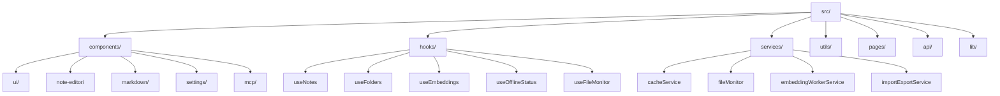
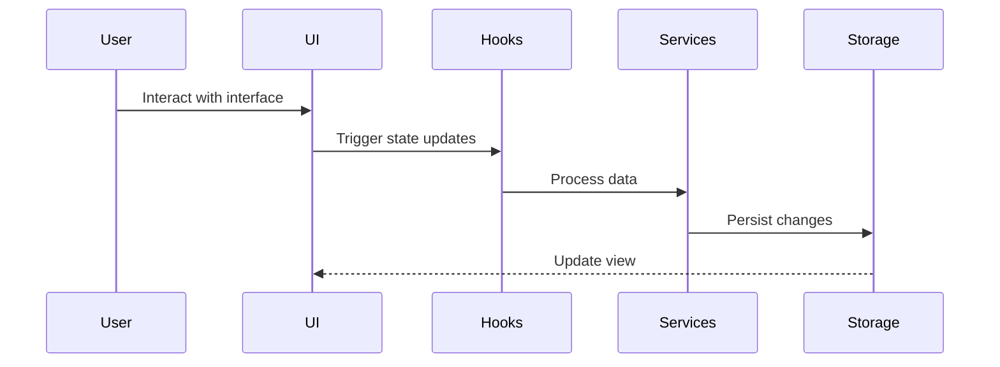

# CogniCore Project Overview

## Introduction
CogniCore is a sophisticated note-taking and knowledge management application built with React, TypeScript, and modern web technologies. It features a rich set of capabilities including real-time note editing, graph visualization, offline support, and AI-powered features.

## Tech Stack
- **Frontend Framework**: React 18 with TypeScript
- **Build Tool**: Vite
- **Styling**: Tailwind CSS with shadcn/ui components
- **State Management**: React Query (TanStack Query)
- **Routing**: React Router
- **UI Components**: Radix UI primitives with custom styling
- **Data Visualization**: Cytoscape.js for graph visualization
- **Markdown Support**: React Markdown with GFM
- **Form Handling**: React Hook Form with Zod validation
- **Date Handling**: date-fns
- **Charts**: Recharts

## Core Features
1. **Note Management**
   - Rich text editing with Markdown support
   - Hierarchical folder structure
   - Real-time updates
   - Graph visualization of note relationships

2. **AI Integration**
   - Embedding service for semantic search
   - Chat interface for AI interactions
   - LM Studio integration

3. **Offline Capabilities**
   - Offline-first architecture
   - Queue system for pending operations
   - Cache management
   - File monitoring system

4. **Data Management**
   - Import/Export functionality
   - Local storage management
   - File system monitoring
   - Caching system

5. **User Interface**
   - Responsive design
   - Dark/Light theme support
   - Resizable panels
   - Customizable layout

## Project Structure


## Key Components
1. **App.tsx**: Main application entry point
   - Sets up providers (Query, Router, Folders)
   - Initializes core services
   - Handles diagnostic mode

2. **Index.tsx**: Main page layout
   - Manages sidebar state
   - Handles section switching
   - Controls chat interface visibility

3. **Core Components**
   - `NoteEditor`: Rich text editor for notes
   - `GraphVisualization`: Interactive graph view
   - `ChatInterface`: AI interaction interface
   - `Sidebar`: Navigation and folder management
   - `SettingsPanel`: Application configuration

## State Management
The application uses a combination of:
- React Query for server state
- Custom hooks for local state
- Context providers for shared state
- Local storage for persistence

## Data Flow


## Development Guidelines
1. **Component Structure**
   - Use functional components with hooks
   - Implement proper TypeScript types
   - Follow shadcn/ui component patterns

2. **State Management**
   - Use React Query for async operations
   - Implement custom hooks for reusable logic
   - Maintain proper separation of concerns

3. **Styling**
   - Use Tailwind CSS classes
   - Follow the established design system
   - Maintain responsive design principles

4. **Performance**
   - Implement proper caching strategies
   - Use React.memo when necessary
   - Optimize bundle size

## Getting Started
1. Install dependencies:
   ```bash
   npm install
   ```

2. Start development server:
   ```bash
   npm run dev
   ```

3. Build for production:
   ```bash
   npm run build
   ```

## Contributing
1. Follow the established code style
2. Write meaningful commit messages
3. Update documentation as needed
4. Test thoroughly before submitting PRs 