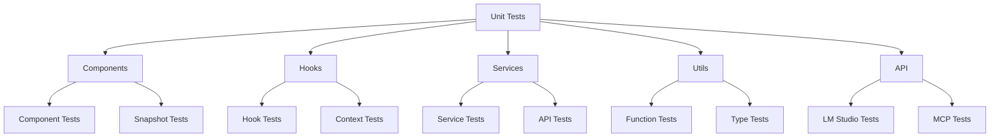
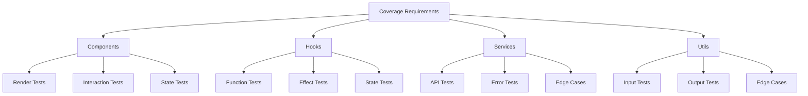
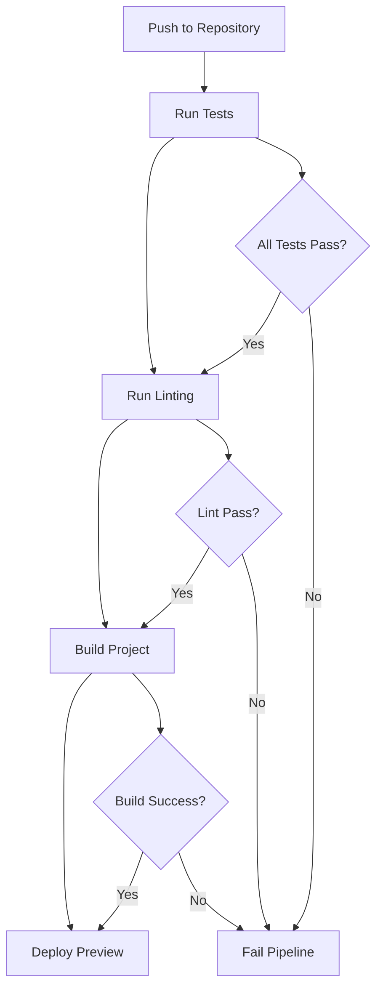

# Testing Documentation

## Testing Strategy

### Test Types

1. **Unit Tests**
   - Component testing
   - Hook testing
   - Service testing
   - Utility function testing
   - LM Studio integration testing
   - MCP server testing

2. **Integration Tests**
   - Component integration
   - Service integration
   - API integration
   - Database operations
   - LM Studio API integration
   - MCP server integration

3. **End-to-End Tests**
   - User flows
   - Critical paths
   - Edge cases
   - Error scenarios
   - Chat completion flows
   - Model selection flows

4. **Performance Tests**
   - Load testing
   - Stress testing
   - Memory leak detection
   - Response time measurement
   - API response times
   - Model loading times

## Test Structure

### Unit Test Organization


### Test File Structure
```
src/
  __tests__/
    components/
      NoteEditor.test.tsx
      GraphVisualization.test.tsx
      ChatInterface.test.tsx
      ServerConfig.test.tsx
    hooks/
      useNotes.test.tsx
      useFolders.test.tsx
      useLMStudio.test.tsx
      useMCPServers.test.tsx
    services/
      cacheService.test.ts
      fileMonitor.test.ts
      lmStudioService.test.ts
      mcpService.test.ts
    utils/
      validation.test.ts
      formatting.test.ts
    api/
      lmStudioApi.test.ts
      mcpApi.test.ts
```

## Testing Tools

### Test Framework
```typescript
// Jest Configuration
export default {
  preset: 'ts-jest',
  testEnvironment: 'jsdom',
  setupFilesAfterEnv: ['<rootDir>/src/setupTests.ts'],
  moduleNameMapper: {
    '^@/(.*)$': '<rootDir>/src/$1',
  },
  collectCoverageFrom: [
    'src/**/*.{ts,tsx}',
    '!src/**/*.d.ts',
    '!src/index.tsx',
  ],
  coverageThreshold: {
    global: {
      branches: 80,
      functions: 80,
      lines: 80,
      statements: 80,
    },
  },
};
```

### Test Utilities
```typescript
// Test Utilities
export const renderWithProviders = (
  ui: React.ReactElement,
  {
    preloadedState = {},
    store = configureStore({ reducer: rootReducer, preloadedState }),
    ...renderOptions
  } = {}
) => {
  return render(
    <Provider store={store}>
      <ThemeProvider>
        {ui}
      </ThemeProvider>
    </Provider>,
    renderOptions
  );
};

export const mockFileSystem = {
  showDirectoryPicker: jest.fn(),
  showOpenFilePicker: jest.fn(),
  showSaveFilePicker: jest.fn(),
};

export const mockLMStudio = {
  chatCompletion: jest.fn(),
  getModels: jest.fn(),
  validateConfig: jest.fn(),
};

export const mockMCP = {
  sendRequest: jest.fn(),
  validateServer: jest.fn(),
  getServerStatus: jest.fn(),
};
```

## Component Testing

### LM Studio Component Test Example
```typescript
describe('ServerConfig', () => {
  it('renders with initial config', () => {
    const { getByRole } = render(
      <ServerConfig initialConfig={{
        baseUrl: 'http://localhost:1234',
        primaryModelName: 'test-model',
        secondaryModelName: 'test-model-2'
      }} />
    );
    
    expect(getByRole('textbox', { name: /base url/i })).toHaveValue('http://localhost:1234');
    expect(getByRole('combobox', { name: /primary model/i })).toHaveValue('test-model');
  });
  
  it('handles config changes', async () => {
    const onChange = jest.fn();
    const { getByRole } = render(
      <ServerConfig onChange={onChange} />
    );
    
    const baseUrlInput = getByRole('textbox', { name: /base url/i });
    await userEvent.type(baseUrlInput, 'http://localhost:5678');
    
    expect(onChange).toHaveBeenCalledWith(expect.objectContaining({
      baseUrl: 'http://localhost:5678'
    }));
  });
  
  it('validates connection', async () => {
    const { getByRole, findByText } = render(
      <ServerConfig />
    );
    
    const testButton = getByRole('button', { name: /test connection/i });
    await userEvent.click(testButton);
    
    const status = await findByText(/connection successful/i);
    expect(status).toBeInTheDocument();
  });
});
```

### MCP Component Test Example
```typescript
describe('MCPServerList', () => {
  it('renders server list', () => {
    const servers = [
      { id: '1', name: 'Test Server', url: 'http://test.com' }
    ];
    
    const { getByText } = render(
      <MCPServerList servers={servers} />
    );
    
    expect(getByText('Test Server')).toBeInTheDocument();
    expect(getByText('http://test.com')).toBeInTheDocument();
  });
  
  it('handles server selection', async () => {
    const onSelect = jest.fn();
    const { getByRole } = render(
      <MCPServerList onSelect={onSelect} />
    );
    
    const server = getByRole('button', { name: /test server/i });
    await userEvent.click(server);
    
    expect(onSelect).toHaveBeenCalledWith('1');
  });
  
  it('validates server configuration', async () => {
    const { getByRole, findByText } = render(
      <MCPServerList />
    );
    
    const addButton = getByRole('button', { name: /add server/i });
    await userEvent.click(addButton);
    
    const urlInput = getByRole('textbox', { name: /server url/i });
    await userEvent.type(urlInput, 'invalid-url');
    
    const error = await findByText(/invalid url/i);
    expect(error).toBeInTheDocument();
  });
});
```

## Hook Testing

### LM Studio Hook Test Example
```typescript
describe('useLMStudio', () => {
  it('loads configuration', async () => {
    const { result } = renderHook(() => useLMStudio());
    
    await act(async () => {
      await result.current.loadConfig();
    });
    
    expect(result.current.config).toBeDefined();
    expect(result.current.config.baseUrl).toBe('http://localhost:1234');
  });
  
  it('validates model selection', async () => {
    const { result } = renderHook(() => useLMStudio());
    
    await act(async () => {
      await result.current.selectModel('test-model');
    });
    
    expect(result.current.selectedModel).toBe('test-model');
    expect(result.current.isValid).toBe(true);
  });
  
  it('handles connection errors', async () => {
    const { result } = renderHook(() => useLMStudio());
    
    await act(async () => {
      await result.current.testConnection();
    });
    
    expect(result.current.error).toBeDefined();
    expect(result.current.isConnected).toBe(false);
  });
});
```

### MCP Hook Test Example
```typescript
describe('useMCPServers', () => {
  it('manages server list', async () => {
    const { result } = renderHook(() => useMCPServers());
    
    await act(async () => {
      await result.current.addServer({
        name: 'Test Server',
        url: 'http://test.com',
        apiKey: 'test-key'
      });
    });
    
    expect(result.current.servers).toHaveLength(1);
    expect(result.current.servers[0].name).toBe('Test Server');
  });
  
  it('validates server configuration', async () => {
    const { result } = renderHook(() => useMCPServers());
    
    await act(async () => {
      await result.current.validateServer({
        url: 'invalid-url',
        apiKey: 'test-key'
      });
    });
    
    expect(result.current.error).toBeDefined();
    expect(result.current.isValid).toBe(false);
  });
  
  it('handles server selection', async () => {
    const { result } = renderHook(() => useMCPServers());
    
    await act(async () => {
      await result.current.selectServer('1');
    });
    
    expect(result.current.selectedServer).toBe('1');
    expect(result.current.isActive).toBe(true);
  });
});
```

## Service Testing

### LM Studio Service Test Example
```typescript
describe('lmStudioService', () => {
  beforeEach(() => {
    jest.clearAllMocks();
  });
  
  it('sends chat completion request', async () => {
    const response = await lmStudioService.chatCompletion({
      messages: [{ role: 'user', content: 'test' }],
      model: 'test-model'
    });
    
    expect(mockLMStudio.chatCompletion).toHaveBeenCalledWith({
      messages: [{ role: 'user', content: 'test' }],
      model: 'test-model'
    });
    expect(response).toBeDefined();
  });
  
  it('handles streaming responses', async () => {
    const stream = await lmStudioService.streamChatCompletion({
      messages: [{ role: 'user', content: 'test' }],
      model: 'test-model'
    });
    
    expect(stream).toBeDefined();
    expect(stream.on).toBeDefined();
  });
  
  it('validates configuration', async () => {
    const isValid = await lmStudioService.validateConfig({
      baseUrl: 'http://localhost:1234',
      primaryModelName: 'test-model'
    });
    
    expect(mockLMStudio.validateConfig).toHaveBeenCalled();
    expect(isValid).toBe(true);
  });
});
```

### MCP Service Test Example
```typescript
describe('mcpService', () => {
  beforeEach(() => {
    jest.clearAllMocks();
  });
  
  it('sends request to server', async () => {
    const response = await mcpService.sendRequest({
      serverId: '1',
      endpoint: '/test',
      method: 'GET'
    });
    
    expect(mockMCP.sendRequest).toHaveBeenCalledWith({
      serverId: '1',
      endpoint: '/test',
      method: 'GET'
    });
    expect(response).toBeDefined();
  });
  
  it('validates server configuration', async () => {
    const isValid = await mcpService.validateServer({
      url: 'http://test.com',
      apiKey: 'test-key'
    });
    
    expect(mockMCP.validateServer).toHaveBeenCalled();
    expect(isValid).toBe(true);
  });
  
  it('handles server errors', async () => {
    mockMCP.sendRequest.mockRejectedValue(new Error('Server error'));
    
    await expect(mcpService.sendRequest({
      serverId: '1',
      endpoint: '/test',
      method: 'GET'
    })).rejects.toThrow('Server error');
  });
});
```

## Integration Testing

### Chat Flow Integration Test
```typescript
describe('Chat Flow Integration', () => {
  it('completes chat flow with LM Studio', async () => {
    const { result: chatHook } = renderHook(() => useChatHistory());
    const { result: lmStudioHook } = renderHook(() => useLMStudio());
    
    // Initialize LM Studio
    await act(async () => {
      await lmStudioHook.current.loadConfig();
    });
    
    // Send message
    await act(async () => {
      await chatHook.current.sendMessage('test message');
    });
    
    // Verify response
    expect(chatHook.current.messages).toHaveLength(2);
    expect(chatHook.current.messages[1].content).toBeDefined();
  });
  
  it('handles model switching', async () => {
    const { result: lmStudioHook } = renderHook(() => useLMStudio());
    const { result: chatHook } = renderHook(() => useChatHistory());
    
    // Switch model
    await act(async () => {
      await lmStudioHook.current.selectModel('new-model');
    });
    
    // Send message with new model
    await act(async () => {
      await chatHook.current.sendMessage('test message');
    });
    
    expect(chatHook.current.messages[1].metadata.model).toBe('new-model');
  });
});
```

### Server Configuration Integration Test
```typescript
describe('Server Configuration Integration', () => {
  it('manages MCP server configuration', async () => {
    const { result: mcpHook } = renderHook(() => useMCPServers());
    const { result: lmStudioHook } = renderHook(() => useLMStudio());
    
    // Add server
    await act(async () => {
      await mcpHook.current.addServer({
        name: 'Test Server',
        url: 'http://test.com',
        apiKey: 'test-key'
      });
    });
    
    // Select server
    await act(async () => {
      await mcpHook.current.selectServer('1');
    });
    
    // Verify LM Studio config
    expect(lmStudioHook.current.config.baseUrl).toBe('http://test.com');
  });
  
  it('handles server validation', async () => {
    const { result: mcpHook } = renderHook(() => useMCPServers());
    
    // Test invalid server
    await act(async () => {
      await mcpHook.current.validateServer({
        url: 'invalid-url',
        apiKey: 'test-key'
      });
    });
    
    expect(mcpHook.current.error).toBeDefined();
    expect(mcpHook.current.isValid).toBe(false);
  });
});
```

## End-to-End Testing

### E2E Test Example
```typescript
describe('Note Management Flow', () => {
  it('creates, edits, and deletes a note', async () => {
    // Start at home page
    await page.goto('/');
    
    // Create note
    await page.click('[data-testid="create-note-button"]');
    await page.fill('[data-testid="note-title"]', 'Test Note');
    await page.fill('[data-testid="note-content"]', 'Test Content');
    await page.click('[data-testid="save-note-button"]');
    
    // Verify note was created
    await expect(page.locator('[data-testid="note-list"]')).toContainText('Test Note');
    
    // Edit note
    await page.click('[data-testid="edit-note-button"]');
    await page.fill('[data-testid="note-content"]', 'Updated Content');
    await page.click('[data-testid="save-note-button"]');
    
    // Verify note was updated
    await expect(page.locator('[data-testid="note-content"]')).toContainText('Updated Content');
    
    // Delete note
    await page.click('[data-testid="delete-note-button"]');
    await page.click('[data-testid="confirm-delete-button"]');
    
    // Verify note was deleted
    await expect(page.locator('[data-testid="note-list"]')).not.toContainText('Test Note');
  });
});
```

## Performance Testing

### Performance Test Example
```typescript
describe('Performance Tests', () => {
  it('handles large note lists', async () => {
    const startTime = performance.now();
    
    // Create 1000 notes
    for (let i = 0; i < 1000; i++) {
      await notesService.createNote({
        title: `Note ${i}`,
        content: `Content ${i}`,
      });
    }
    
    // Render note list
    const { container } = render(<NotesList />);
    
    const endTime = performance.now();
    expect(endTime - startTime).toBeLessThan(1000); // Should render within 1 second
  });
  
  it('maintains smooth scrolling', async () => {
    const { container } = render(<NotesList />);
    
    // Scroll through list
    const scrollContainer = container.querySelector('[data-testid="scroll-container"]');
    scrollContainer.scrollTop = 1000;
    
    // Check for frame drops
    const frameTimes = await measureFrameTimes();
    expect(frameTimes.every(time => time < 16)).toBe(true); // 60fps
  });
});
```

## Test Coverage

### Coverage Requirements


## Continuous Integration

### CI Pipeline


## Test Maintenance

### Maintenance Guidelines
1. **Test Organization**
   - Keep tests close to implementation
   - Use consistent naming conventions
   - Group related tests together
   - Maintain test hierarchy

2. **Test Quality**
   - Write meaningful assertions
   - Avoid test duplication
   - Keep tests independent
   - Use appropriate test types

3. **Test Performance**
   - Mock external dependencies
   - Use efficient test setup
   - Clean up after tests
   - Monitor test execution time

4. **Test Documentation**
   - Document test requirements
   - Explain complex test scenarios
   - Keep test descriptions clear
   - Update documentation with changes 
   - Update documentation with changes 