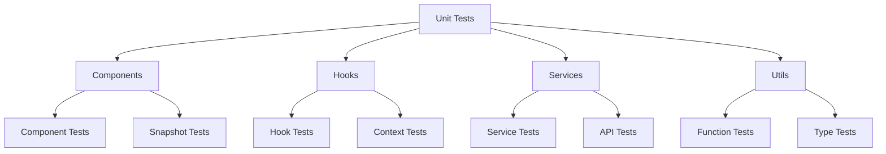
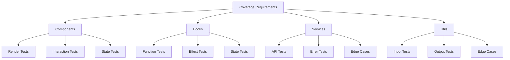
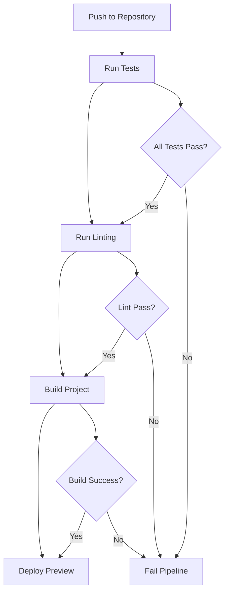

# Testing Documentation

## Testing Strategy

### Test Types

1. **Unit Tests**
   - Component testing
   - Hook testing
   - Service testing
   - Utility function testing

2. **Integration Tests**
   - Component integration
   - Service integration
   - API integration
   - Database operations

3. **End-to-End Tests**
   - User flows
   - Critical paths
   - Edge cases
   - Error scenarios

4. **Performance Tests**
   - Load testing
   - Stress testing
   - Memory leak detection
   - Response time measurement

## Test Structure

### Unit Test Organization


### Test File Structure
```
src/
  __tests__/
    components/
      NoteEditor.test.tsx
      GraphVisualization.test.tsx
    hooks/
      useNotes.test.tsx
      useFolders.test.tsx
    services/
      cacheService.test.ts
      fileMonitor.test.ts
    utils/
      validation.test.ts
      formatting.test.ts
```

## Testing Tools

### Test Framework
```typescript
// Jest Configuration
export default {
  preset: 'ts-jest',
  testEnvironment: 'jsdom',
  setupFilesAfterEnv: ['<rootDir>/src/setupTests.ts'],
  moduleNameMapper: {
    '^@/(.*)$': '<rootDir>/src/$1',
  },
  collectCoverageFrom: [
    'src/**/*.{ts,tsx}',
    '!src/**/*.d.ts',
    '!src/index.tsx',
  ],
  coverageThreshold: {
    global: {
      branches: 80,
      functions: 80,
      lines: 80,
      statements: 80,
    },
  },
};
```

### Test Utilities
```typescript
// Test Utilities
export const renderWithProviders = (
  ui: React.ReactElement,
  {
    preloadedState = {},
    store = configureStore({ reducer: rootReducer, preloadedState }),
    ...renderOptions
  } = {}
) => {
  return render(
    <Provider store={store}>
      <ThemeProvider>
        {ui}
      </ThemeProvider>
    </Provider>,
    renderOptions
  );
};

export const mockFileSystem = {
  showDirectoryPicker: jest.fn(),
  showOpenFilePicker: jest.fn(),
  showSaveFilePicker: jest.fn(),
};
```

## Component Testing

### Component Test Example
```typescript
describe('NoteEditor', () => {
  it('renders with initial content', () => {
    const { getByRole } = render(
      <NoteEditor initialContent="Test content" />
    );
    
    expect(getByRole('textbox')).toHaveValue('Test content');
  });
  
  it('handles content changes', async () => {
    const onChange = jest.fn();
    const { getByRole } = render(
      <NoteEditor onChange={onChange} />
    );
    
    const editor = getByRole('textbox');
    await userEvent.type(editor, 'New content');
    
    expect(onChange).toHaveBeenCalledWith('New content');
  });
  
  it('saves content on blur', async () => {
    const onSave = jest.fn();
    const { getByRole } = render(
      <NoteEditor onSave={onSave} />
    );
    
    const editor = getByRole('textbox');
    await userEvent.type(editor, 'Content to save');
    await userEvent.tab();
    
    expect(onSave).toHaveBeenCalledWith('Content to save');
  });
});
```

## Hook Testing

### Hook Test Example
```typescript
describe('useNotes', () => {
  it('creates a new note', async () => {
    const { result } = renderHook(() => useNotes());
    
    await act(async () => {
      await result.current.createNote({
        title: 'Test Note',
        content: 'Test Content',
      });
    });
    
    expect(result.current.notes).toHaveLength(1);
    expect(result.current.notes[0].title).toBe('Test Note');
  });
  
  it('updates an existing note', async () => {
    const { result } = renderHook(() => useNotes());
    
    const note = await result.current.createNote({
      title: 'Original Title',
      content: 'Original Content',
    });
    
    await act(async () => {
      await result.current.updateNote(note.id, {
        title: 'Updated Title',
      });
    });
    
    expect(result.current.notes[0].title).toBe('Updated Title');
  });
});
```

## Service Testing

### Service Test Example
```typescript
describe('cacheService', () => {
  beforeEach(() => {
    localStorage.clear();
  });
  
  it('stores and retrieves data', async () => {
    const data = { key: 'value' };
    await cacheService.set('test-key', data);
    
    const retrieved = await cacheService.get('test-key');
    expect(retrieved).toEqual(data);
  });
  
  it('handles cache expiration', async () => {
    const data = { key: 'value' };
    await cacheService.set('test-key', data, 100); // 100ms TTL
    
    await new Promise(resolve => setTimeout(resolve, 150));
    
    const retrieved = await cacheService.get('test-key');
    expect(retrieved).toBeNull();
  });
});
```

## Integration Testing

### Integration Test Example
```typescript
describe('Note Creation Flow', () => {
  it('creates note and generates embedding', async () => {
    const { result: notesHook } = renderHook(() => useNotes());
    const { result: embeddingHook } = renderHook(() => useEmbeddings());
    
    // Create note
    const note = await notesHook.current.createNote({
      title: 'Test Note',
      content: 'Test Content',
    });
    
    // Wait for embedding generation
    await waitFor(() => {
      expect(embeddingHook.current.embeddings[note.id]).toBeDefined();
    });
    
    // Verify embedding was stored
    const embedding = await databaseService.getEmbedding(note.id);
    expect(embedding).toBeDefined();
    expect(embedding.vector).toHaveLength(EMBEDDING_DIMENSION);
  });
});
```

## End-to-End Testing

### E2E Test Example
```typescript
describe('Note Management Flow', () => {
  it('creates, edits, and deletes a note', async () => {
    // Start at home page
    await page.goto('/');
    
    // Create note
    await page.click('[data-testid="create-note-button"]');
    await page.fill('[data-testid="note-title"]', 'Test Note');
    await page.fill('[data-testid="note-content"]', 'Test Content');
    await page.click('[data-testid="save-note-button"]');
    
    // Verify note was created
    await expect(page.locator('[data-testid="note-list"]')).toContainText('Test Note');
    
    // Edit note
    await page.click('[data-testid="edit-note-button"]');
    await page.fill('[data-testid="note-content"]', 'Updated Content');
    await page.click('[data-testid="save-note-button"]');
    
    // Verify note was updated
    await expect(page.locator('[data-testid="note-content"]')).toContainText('Updated Content');
    
    // Delete note
    await page.click('[data-testid="delete-note-button"]');
    await page.click('[data-testid="confirm-delete-button"]');
    
    // Verify note was deleted
    await expect(page.locator('[data-testid="note-list"]')).not.toContainText('Test Note');
  });
});
```

## Performance Testing

### Performance Test Example
```typescript
describe('Performance Tests', () => {
  it('handles large note lists', async () => {
    const startTime = performance.now();
    
    // Create 1000 notes
    for (let i = 0; i < 1000; i++) {
      await notesService.createNote({
        title: `Note ${i}`,
        content: `Content ${i}`,
      });
    }
    
    // Render note list
    const { container } = render(<NotesList />);
    
    const endTime = performance.now();
    expect(endTime - startTime).toBeLessThan(1000); // Should render within 1 second
  });
  
  it('maintains smooth scrolling', async () => {
    const { container } = render(<NotesList />);
    
    // Scroll through list
    const scrollContainer = container.querySelector('[data-testid="scroll-container"]');
    scrollContainer.scrollTop = 1000;
    
    // Check for frame drops
    const frameTimes = await measureFrameTimes();
    expect(frameTimes.every(time => time < 16)).toBe(true); // 60fps
  });
});
```

## Test Coverage

### Coverage Requirements


## Continuous Integration

### CI Pipeline


## Test Maintenance

### Maintenance Guidelines
1. **Test Organization**
   - Keep tests close to implementation
   - Use consistent naming conventions
   - Group related tests together
   - Maintain test hierarchy

2. **Test Quality**
   - Write meaningful assertions
   - Avoid test duplication
   - Keep tests independent
   - Use appropriate test types

3. **Test Performance**
   - Mock external dependencies
   - Use efficient test setup
   - Clean up after tests
   - Monitor test execution time

4. **Test Documentation**
   - Document test requirements
   - Explain complex test scenarios
   - Keep test descriptions clear
   - Update documentation with changes 